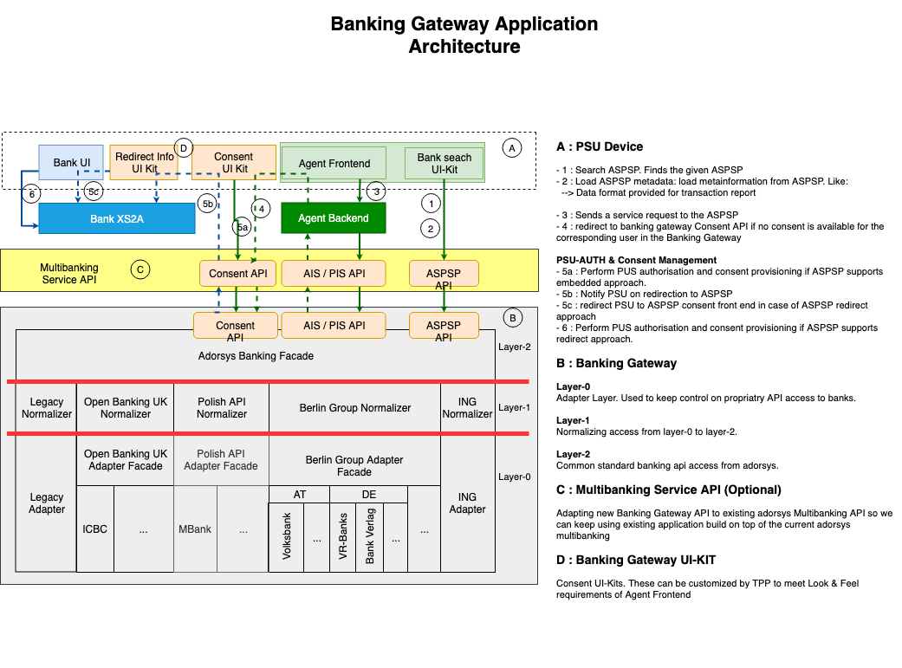

# Open Banking Gateway
Provides tools, adapters and connectors for transparent access to open banking apis. The initial effort focuses on the connectivity to banks that implement the European PSD2 directive either through one of the common market initiatives like :
  * [The Berlin Group NextGenPSD2](https://www.berlin-group.org/psd2-access-to-bank-accounts),
  * [The Open Banking UK](https://www.openbanking.org.uk/),
  * [The Polish PSD2 API](https://polishapi.org/en/)

or even through proprietary bank api like [the ING’s PSD2 API](https://developer.ing.com/openbanking/).

## What this Project is about

### Key Challenge for a TPPs

PSD2 as the first regulatory driven Open Banking initiative offers many opportunities for both Banks and Third Party Providers. TPPs can use the account information and payment services provided by the banks in order to offer new innovative services to the end users. The more banks a TPP can interact with each other, the more end consumer can be provided with reacher banking solutions, which in turn simplifies and leverage commercial value chains.  
Being able to interact with different bank APIs can be a time and cost consuming challenge. Even though PSD2 sets a standard for bank interfaces, there is a lot of space for implementation options. A bank, therefore, can have it's own PSD2 compliant solution or implement one of the known market standards, like Open Banking UK, Berlin Group or STET. This open banking gateway will provide with a common interface with the aim of simplifying access to those APIs by third parties. 

### Third Parties Contribution

This project is designed to enable contribution from different sources, as the open banking challenge will start with a magnitude of discrepancies in individual bank implementations, even for banks implementing a common standards.

The following picture displays the overall architecture of this banking gateway:

## Releases and versions

* [Versioning, Release and Support policy](docs/Version_Policy.md)
 
* [Release notes](docs/releasenotes.md) 
* [Roadmap for next features development](docs/roadmap.md)
 
### Testing API with Postman json collections
 
 For testing API of the banking gateway it is used Postman https://www.getpostman.com/
 Environment jsons with global parameter’s sets and Collections of jsons for imitation of processes flows are stored in /postman folder.
 To import Postman collections and environments follow next steps:
 1. Download Postman jsons with collections and environments to your local machine.
 2. Open Postman, press button “Import”.
 3. Choose “Import file” to import one json or “Import folder” to import all jsons within the folder, then press button “Choose Files” or “Choose Folders” and open necessary files/folders.
 4. To change settings of environments - go to “Manage Environments”, press the environment name and change variables.
 
 To start testing with Postman collections it is necessary to have all services running.
 
 
## Authors & Contact

* **[Francis Pouatcha](mailto:fpo@adorsys.de)** - *Initial work* - [adorsys](https://www.adorsys.de)

See also the list of [contributors](https://github.com/adorsys/open-banking-gateway/graphs/contributors) who participated in this project.

For commercial support please contact **[adorsys Team](https://adorsys.de/en/psd2)**.

## License

This project is licensed under the Apache License version 2.0 - see the [LICENSE](LICENSE) file for details

