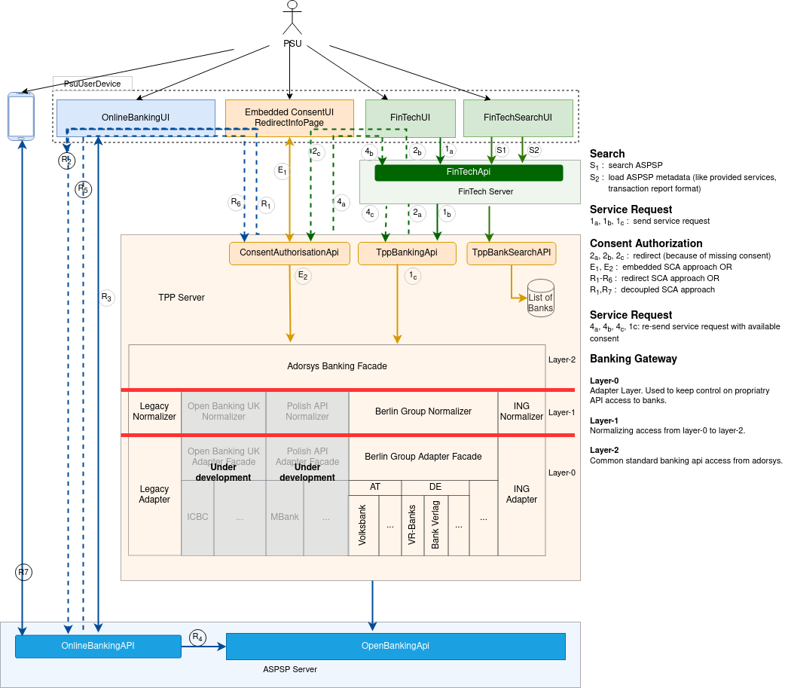
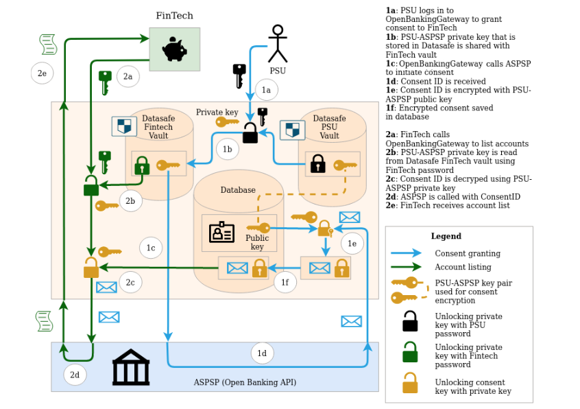

**Code coverage**
 - Backend: 
 - Frontend: 
 - Example code: 

# Changes in OSS release policy

For the time being, version 1.0.0 will be the current try-out version of Open-Banking Gateway that adorsys publishes on GitHub. 
With PSD2 standards and our solutions having grown to maturity in production, our continuous investment in development and maintenance 
of our XS2A projects forces us to focus on our commercial engagements.
We are committed to continuous active development of our XS2A solutions to ensure constant adherence to the latest Berlin Group 
specifications and to support OpenFinance initiatives.
Existing published versions will remain available under their respective open-source licenses.
If you are a user of our XS2A solutions and would like to either start or extend cooperation, please contact us under psd2@adorsys.com.

# Licensing model change to dual license: _AGPL v.3_ or _commercial license_

**Attention: this open-source project will change its licensing model as of _01.01.2022_!**

Constantly evolving and extending scope, production traffic and support in open banking world call for high maintenance and service investments on our part.

Henceforth, adorsys will offer all versions higher than v1.0 of Open Banking Gateway under a dual-license model. 
Thus, this repository will be available either under Affero GNU General Public License v.3 (AGPL v.3) or alternatively under a commercial license agreement.

We would like to thank all our users for their trust so far and are convinced that we will be able to provide an even better service going forward.

For more information, advice for your implementation project or if your use case requires more time to adapt this change, 
please contact us at [psd2@adorsys.com](mailto:psd2@adorsys.com).

For additional details please see the section [FAQ on Licensing Change](#faq-on-licensing-change).

# Open Banking Gateway
Provides tools, adapters and connectors for transparent access to open banking apis. The initial effort focuses on the connectivity to banks that implement the European PSD2 directive either through one of the common market initiatives like : [The Berlin Group NextGenPSD2](https://www.berlin-group.org/psd2-access-to-bank-accounts), [The Open Banking UK](https://www.openbanking.org.uk/), [The Polish PSD2 API](https://polishapi.org/en/) or even through proprietary bank api like  [the ING’s PSD2 API](https://developer.ing.com/openbanking/).

## What this Project is about

### Tackle the Key Challenge for Third Party Providers of Payment Services
The European PSD2 as the first regulator driven Open Banking initiative offers many opportunities for both banks, known as traditional provider of payment services (called ASPSPs in this context) and other Third Party Providers of payment services (TPPs). TPPs can use account information and payment services provided by banks to offer new innovative services to bank account holders. The more banks and TPPs can interact with each other, the more payment account holders can be provided with reacher banking solutions, which in turn simplifies and leverage commercial value chains.

Being able to interact with different banking APIs can be a time and cost consuming challenge. Even though the PSD2 requires European banks to provide APIs and despite the effort of market initiatives to provide common standard interfaces, there is still a multitude of divergent authorization schemes involved and a lot of space for implementation options. A bank can even decide not to join one of the known market initiatives and define it's own PSD2 compliant API. 

The purpose of this open banking gateway is to provide the community with a common and simple interface for accessing major Open Banking APIs.

### Introducing the FinTech as a Major Role
Being a regulator driven initiative, PSD2 mandates the regulation of TPPs. With this additional detail, the market is experiencing a distinction between regulated TPPs and non regulated FinTechs. This framework is therefore designed taking in consideration the existence of the category of payment service providers called FinTech that used APIs exposed by a regulated TPP to access payment services exposed by banks.

### Address Security Issues associated with PSU Access to Multiple Interfaces
In the Open Banking Context, a payment service user (PSU or banking account holder) might have to deal with up to 3 different user interface to initiate, authorize and get the requested banking service executed. There being redirected back and forth from one UserAgent (resp. device) to another. This intensive use of redirection in Open Banking bearing a lot of risk of impersonating the PSU, we set a goal of this Framework to dissect the complexity involved with those redirection processes and open forums for discussion of possible solutions and sample implementations. Following papers are the first attempt to capture the problem ([UserAgent Redirection](docs/architecture/concepts/psu-device-redirection.md), [PSU Access Security Design](docs/architecture/concepts/psu-security-concept.md)).  
 
 
## Project Demo
 
 - [Demo deployment and guide](docs/demo_env.md)

## Big Picture

The following picture displays the overall architecture of this banking gateway:

## Security concept

The following picture displays the overall security concept of this banking gateway:

Security concept has 2 kinds of flows:
  - authenticated (for consent sharing)
  - anonymous (for payments, but can be authenticated too). 

Here are detailed diagrams of each flow:
 - [Authenticated security concept detailed flow](docs/img/security-details/authenticated-security-concept-details.png)
 - [Anonymous security concept detailed flow](docs/img/security-details/anonymous-security-concept-details.png)

## Technical architecture

The following picture displays the overall technical architecture concept of this banking gateway:

**Key components as shown on diagram**:

**APIs:**
 - [Banking API](opba-banking-rest-api) and its implementation [Banking API Impl](opba-banking-rest-impl)
 - [Consent API](opba-consent-rest-api) and its implementation [Consent API Impl](opba-consent-rest-impl)

 **Facade:**
 - [Banking protocol facade](opba-banking-protocol-facade)
 
 **Protocol:**
  - [Banking protocol API](opba-protocols/opba-protocol-api)
  - [XS2A compliant banking protocol Impl](opba-protocols/xs2a-protocol)

## Running the project locally

 - [docker-compose-dev.yml](https://github.com/adorsys/open-banking-gateway/tree/develop/docker-compose-dev.yml) - docker-compose file in the project root for **Development** (requires building docker images)
 - [docker-compose.yml](https://github.com/adorsys/open-banking-gateway/tree/develop/docker-compose.yml) - docker-compose file in the project root for **Demo** (Images will be pulled from DockerHub)

## Postman scripts to play with API 

- [postman-collections](postman/collections)
- [postman-environments](postman/environments) (for playing use [this Postman environment](https://github.com/adorsys/open-banking-gateway/tree/develop/postman/environments/OPBA-DEV-NO-SIG.postman_environment.json))

### Postman collection details

- [postman-ais-collection](https://github.com/adorsys/open-banking-gateway/tree/develop/postman/collections/OPBA-AIS-HBCI-OR-XS2A-EMBEDDED-2-SCA-METHODS.postman_collection.json) Xs2a-embedded or HBCI AIS (account information services) example - getting users' account and transactions list

**Note:** Postman requires disabled request signing functionality - for that use Spring-profile `no-signature-filter`.
You can use our DEV environment (without signature check) if you import [this Postman environment](https://github.com/adorsys/open-banking-gateway/tree/develop/postman/environments/OPBA-DEV-NO-SIG.postman_environment.json)

## Information for developers:
 
 - Working with BPMN: As most protocols use BPMN, we have developed 
 the [plugin 'Flowable BPMN visualizer'](https://plugins.jetbrains.com/plugin/14318-flowable-bpmn-visualizer) that directly integrates into IntelliJ
 with code navigation, refactoring and other stuff for **Flowable BPMN engine**. It will make your work a lot easier
 as you don't need to leave IntelliJ to change diagram or to see what class is used at which step.
 
 - Running local tests faster. To avoid Postgres TestContainer slow initialization one can use following environment variables:
 `TESTCONTAINERS_REUSE_ENABLE=true;TESTCONTAINERS_RYUK_DISABLED=true;SPRING_DATASOURCE_URL=jdbc:tc:postgresql:12:////open_banking?TC_DAEMON=true&?TC_TMPFS=/testtmpfs:rw&TC_INITSCRIPT=init.sql&TC_REUSABLE=true`
  this will keep Postgres TestContainer started and migrated after 1st run, significantly reducing next tests startup time.
  Note, that it will introduce shared state across tests, which is mostly OK but for some tests may cause failures.

 - Starting with project: [How to start with project](https://github.com/adorsys/open-banking-gateway/tree/develop/how-to-start-with-project) 
 
 - Populating database with bank data: [How to fill database with bank data](https://github.com/adorsys/open-banking-gateway/tree/develop/opba-db/README.md) 

## Documentation

Please take a look into our [**documentation**](https://adorsys.github.io/open-banking-gateway/doc/develop/) to know more about:

### Planned and released versions

* [Versioning, Release and Support policy](docs/version_policy.md)
* [Release notes](docs/releasenotes.md) 
* [Roadmap for next features development](docs/roadmap.md)

### Architecture 
* [Dictionary](docs/architecture/dictionary.md)
* [Use Cases](docs/architecture/use_cases.md)
* [Banking Protoсol Design](docs/architecture/technical-details.md)
* [User Agent Redirection](docs/architecture/concepts/psu-device-redirection.md)
* [PSU Access Security Design](docs/architecture/concepts/psu-security-concept.md)
* [JavaDoc](https://adorsys.github.io/open-banking-gateway/javadoc/latest/index.html)

## Third Parties Contribution

This project is designed to enable contribution from different sources, as the open banking challenge will start with a magnitude of discrepancies in individual bank implementations, even for banks implementing a common standards.

### How to contribute

* [Getting started](docs/getting_started.md)
* [Contribution Guidelines](docs/ContributionGuidelines.md) 
 

## Authors & Contact

* **[Francis Pouatcha](mailto:fpo@adorsys.de)** - *Initial work* - [adorsys](https://www.adorsys.de)

See also the list of [contributors](https://github.com/adorsys/open-banking-gateway/graphs/contributors) who participated in this project.

For commercial support please contact **[adorsys Team](https://adorsys.de/)**.

## License

This project is dual licensed under Affero GNU General Public License v.3 (AGPL v.3) or alternatively under a commercial license agreement - see the [LICENSE](LICENSE) file for details.

For commercial inquiries please contact us at psd2@adorsys.com.

For additional details please see the section: FAQ on Licensing Change.

## FAQ on Licensing Change

### What is a dual-licensing model?

Under a dual-licensing model, our product is available under two licenses:

- [The Affero GNU General Public License v3 (AGPL v3)](https://www.gnu.org/licenses/agpl-3.0.en.html)
- A proprietary commercial license

If you are a developer or business that would like to review our products in detail, test and implement in your 
open-source projects and share the changes back to the community, the product repository is freely available under AGPL v3.

If you are a business that would like to implement our products in a commercial setting and would like to protect your 
individual changes, we offer the option to license our products under a commercial license.

This change will still allow free access and ensure openness under AGPL v3 but with assurance of committing any 
alterations or extensions back to the project and preventing redistribution of such implementations under commercial license.

### Will there be any differences between the open-source and commercially licensed versions of your products?

Our public release frequency will be reduced as our focus shifts towards the continuous maintenance of the commercial 
version. Nevertheless, we are committed to also provide open-source releases of our products on a regular basis as per our release policy.

For customers with a commercial license, we will offer new intermediate releases in a more frequent pace.

### Does this mean that this product is no longer open source?

No, the product will still be published and available on GitHub under an OSI-approved open-source license (AGPL v3).

### What about adorsys’ commitment to open source? Will adorsys provide future product releases on GitHub?

We at adorsys are committed to continue actively participating in the open-source community. Our products remain 
licensed under OSI-approved open-source licenses, and we are looking forward to expanding our product portfolio on GitHub even further.

### How does the change impact me if I already use the open-source edition of your product?

All currently published versions until v1.0 will remain under their current Apache 2.0 license and its respective 
requirements and you may continue using it as-is. To upgrade to future versions, you will be required to either abide 
by the requirements of AGPL v3, including documenting and sharing your implemented changes to the product when 
distributing, or alternatively approach us to obtain a commercial license.

### What if I cannot adjust to the new licensing model until 01.01.2022? Can I extend the deadline?

We understand that adjustment to licensing changes can take time and therefore are open to discuss extension options on 
an individual basis. For inquiries please contact us at [psd2@adorsys.com](mailto:psd2@adorsys.com).

### Which versions of the product are affected?

All versions of Open Banking Gateway after v1.0 will be affected by the licensing changes and move to a dual-licensing model.

### What will happen to older, Apache 2.0 licensed product versions?

All older Apache 2.0 licensed versions prior and including v1.0 will remain available under their existing license.

### What open-source products from Adorsys are affected by the licensing change?

The following products are affected:
 - [XS2A Core](https://github.com/adorsys/xs2a)
 - [XS2A Sandbox & ModelBank](https://github.com/adorsys/XS2A-Sandbox)
 - [Open Banking Gateway](https://github.com/adorsys/open-banking-gateway) incl. [XS2A Adapters](https://github.com/adorsys/xs2a-adapter)
 - [SmartAnalytics](https://github.com/adorsys/smartanalytics)
 - [Datasafe](https://github.com/adorsys/datasafe)

### I’m using one of these products indirectly via some software integrator. How does the licensing change affect me?

The licensing change does not affect you as user, but it is relevant to your provider who has used our product in their 
solution implementation. In case of uncertainty please contact your service provider or approach us at [psd2@adorsys.com](mailto:psd2@adorsys.com).
