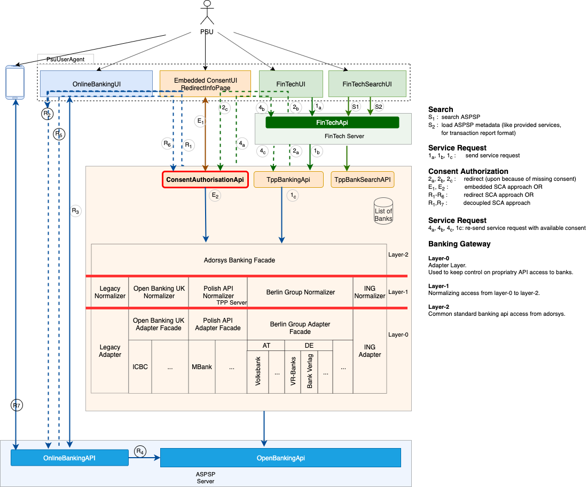

# Open Banking Gateway
Provides tools, adapters and connectors for transparent access to open banking apis. The initial effort focuses on the connectivity to banks that implement the European PSD2 directive either through one of the common market initiatives like :

* [The Berlin Group NextGenPSD2](https://www.berlin-group.org/psd2-access-to-bank-accounts)
* [The Open Banking UK](https://www.openbanking.org.uk/)
* [The Polish PSD2 API](https://polishapi.org/en/)

Or even through proprietary bank api like 

* [the ING’s PSD2 API](https://developer.ing.com/openbanking/)

## What this Project is about

### Tackle the Key Challenge for Third Party Providers of Payment Services

PSD2 as the first regulator driven Open Banking initiative offers many opportunities for both Banks, known as traditional provider of payment services, and other Third Party Providers of payment services (TPPs). TPPs can use account information and payment services provided by banks to offer new innovative services to end users. The more banks a TPPs can interact with each other, the more end consumer can be provided with reacher banking solutions, which in turn simplifies and leverage commercial value chains.

Being able to interact with different bank APIs can be a time and cost consuming challenge. Even though PSD2 sets a standard for bank interfaces, there is a lot of space for implementation options. A bank, therefore, can have it's own PSD2 compliant solution or implement one of the known market standards, like Open Banking UK, Berlin Group's NextGenPSD2 or STET. 

The purpose of this open banking gateway is to provide the community with a common and simple interface for accessing major Open Banking APIs.

### Introduce the FinTech as a Major Role

Being a regulator driven initiative, PSD2 mandate the regulation of TPPs. With this additional detail, the market is experiencing a distinction between regulated TPPs and non regulated FinTechs. This framework therefore designed taking in consideration the existence of the category of payment service providers called FinTech that used APIs exposed by a regulated TPP to access payment services exposed by banks.

### Address Security Issues associated with PSU Access to Multiple Interfaces   
 

## Big Picture

The following picture displays the overall architecture of this banking gateway:

## Documentation

Please take a look into our [**documentation**](https://adorsys.github.io/open-banking-gateway/doc/develop/) to know more about:

### Planned and released versions

* [Versioning, Release and Support policy](docs/version_policy.md)
* [Release notes](docs/releasenotes.md) 
* [Roadmap for next features development](docs/roadmap.md)

### Architecture 
* [Dictionary](docs/architecture/dictionary.md)
* [Use Cases](docs/architecture/use_cases.md)
* [Banking Protokol Design](docs/architecture/drafts/initial_requirements.md)
* [PSU Access Security Design](docs/architecture/concepts/psu-security-concept.md)
* [JavaDoc](https://adorsys.github.io/open-banking-gateway/javadoc/latest/index.html)

## Third Parties Contribution

This project is designed to enable contribution from different sources, as the open banking challenge will start with a magnitude of discrepancies in individual bank implementations, even for banks implementing a common standards.

### How to contribute

* [Getting started](docs/getting_started.md)
* [Contribution Guidelines](docs/ContributionGuidelines.md) 
 
## Authors & Contact

* **[Francis Pouatcha](mailto:fpo@adorsys.de)** - *Initial work* - [adorsys](https://www.adorsys.de)

See also the list of [contributors](https://github.com/adorsys/open-banking-gateway/graphs/contributors) who participated in this project.

For commercial support please contact **[adorsys Team](https://adorsys.de/)**.

## License

This project is licensed under the Apache License version 2.0 - see the [LICENSE](LICENSE) file for details

