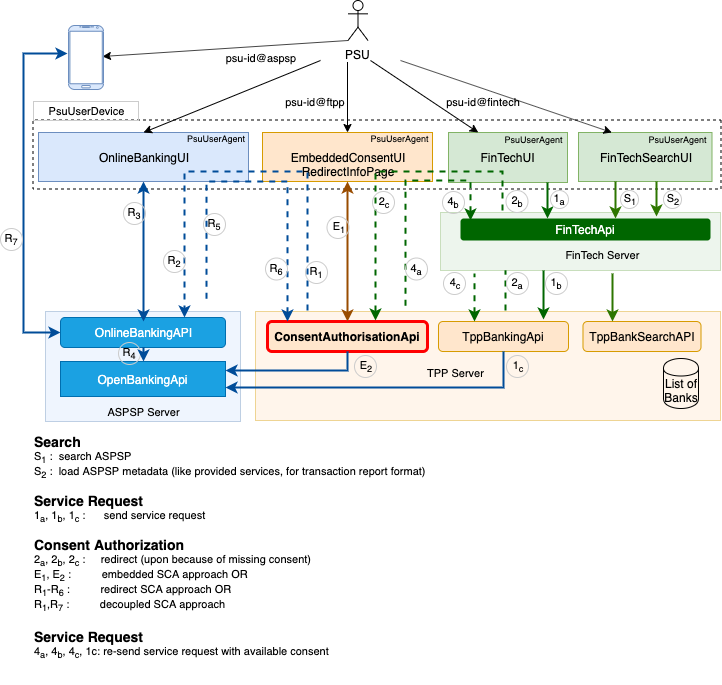
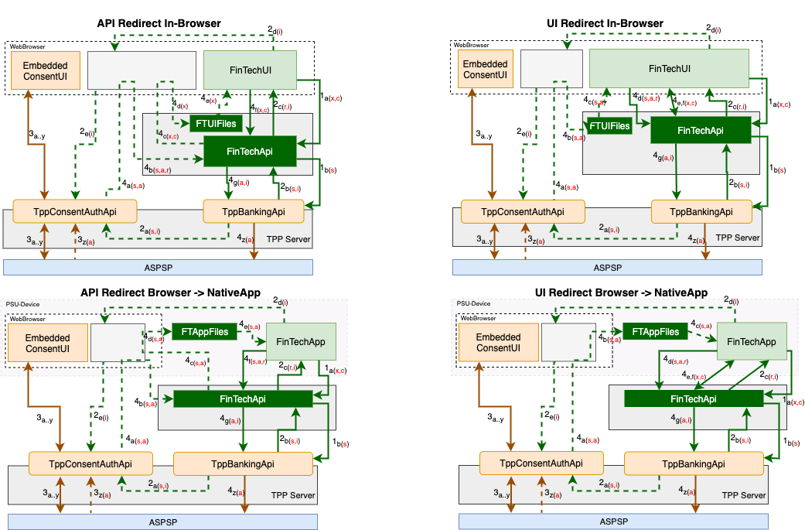

# User Agent Redirection
# Fundamental of User Agent Redirection
 
### Advanced use Cases
The experience realized with sharing identity in online business interaction has lead to an attempt to share even more data and functionality. Many online business platform initiatives are reusing the experience made over the last decade with oAuth, OpenId Connect and other __Identity Sharing__ schemes to define more advanced authorization frameworks that enable the sharing of other data and service on behalf of an end user. In most OpenBanking approaches evolving out there, a banking customer can authorize the custodian of his bank account (the bank) to open some functionalities to third parties. This way a third party provider of online services might pull the list of transactions of the end user's bank account or even initiate a payment on behalf of that end user.

The way a banking user give his consent to the bank is very similar to the way an online use allow the IDP to share his identity with a relying party. As these authorization frameworks are reaching the banking industry, there is an imminent need of providing a very clear understanding of how they work, so we can reduce the number of erroneous implementation on the market. A there will be a bigger incentive for malicious parties to try to exploit weaknesses associated with the implementation of those authorization frameworks.

## Fundamental of a Redirect
The purpose of this work is therefore to enlighten mechanism used in the process of redirecting a PSU from one user agent to another one.

### HTTP vs. XHR Redirect
The HTTP protocol was originally designed to support simple hypertext content production. In this context, necessary intelligence was delegated to the container displaying the produced content. This is the reason why a web browser processing a http response for display will follow 30x responses and proceed with another request to the provided location.

Using javascript to build more interactive browser applications, the XHR protocol was developed as an additional request response protocol between a web browser and a web server. With XHR, redirection is a little more complicated, as the Browser-Api still follows the redirect, but do not display the response in the browser window. Off course the javascript framework used will help read and display the response. But the redirect URL exposed with xhr.responseURL will not contain all original redirect parameters. See [atomic-http-redirect-handling](https://fetch.spec.whatwg.org/#atomic-http-redirect-handling) for details on why underlying browser APIs adopt this behavior.

Beyond web browser, native application are known to have full access on the HTTP Request/Response object. Corresponding HTTP client implementation expose more detailed API that allow to control the behavior of the redirect request. This, we will model the behavior of a redirect in API taking in consideration constraints of browser implementations and ignoring the existence of native applications, knowing that the will be able to provide the behavior expected from browser implementations.

Based on the facts described above, there is 2 options to choose from while implementing a redirect:
- __Given Full Control to User Agent__: if we want the user agent to have full control on the redirect process, we will have to return a __20x and a Location__ response to the user agent and instruct the user agent to proceed to the provided location url. This approach will not work for non javascript enhanced browser based user agents.
- __Preventing Browser Based Agent from accessing URL params__: Exposing url params to browser based user agents might open room for cros side scripting. If the framework is intending to add any sort of secret information to the URL, return a __30x and Location__ will be the best alternative as native browser API will follow the redirect before returning final response to the UserAGent.

User Experience Guide require a user to be notified prior to redirecting the user to another domain. This step shall generally be done in a proper step (rather than abandoned to the UI). By presenting a redirect-info-page to the user, following action can be design to simplify the implementation of the redirect request. E.g.: the redirect info page will offer a confirmation to the user and user a simple HTTP request (no XHR) to trigger the redirect process.

### Response Code Option
Advanced API design can allow the UI to decide if the redirect response has to be controlled by a 20x or a 30x response code.  

## Redirect for Consent Authorization of Banking Services
In OpenBanking initiatives, redirection is generally used to send a payment service user (PSU) to the TPP site, where TPP can authorize the execution of a banking service. In some situation, a TPP will even redirect the PSU to the banking site, so the PSU can interact directly with his bank for the consent authorization. In addition to using those three interfaces, the PSU might sometimes have to be redirected by the TPP or by his bank to the PSU mobile device to collect some OTPs. The following picture shows the PSU interfaces with all FinTech, TPP and Bank.

Without redirection, PSU will have to manually provide authorization to each party, in the worse case, physically, having to go to the bank or third party's agency location.

With redirection, we gain in speed and usability, but care has to be taken no to provide room for impersonation of the PSU. The purpose of this section is describe steps necessary to perform redirection without risk of impersonating the PSU.

In the analysis, we identified two types of redirections:
- API redirection, where the RedirectUrl directly points to a server API
- UI redirection, where the redirect link either starts a native application on the user device of load the UI files from the designated content server. 

In all cases, we assume that UI file servers do not share the same domain (origin) as their corresponding API server. This is, we do not expect UI file servers to receive/process cookies set by API servers. The following picture displays 4 possible scenarios.

All 4 scenarios implement the same process of a redirect from a FinTech application to a TPP application for having the PSU authorizing a banking service, and a redirect back from the TPP to the FinTech with a confirmation code. Theoretically none of those redirects can ever be protected, as there can't be any deterministic assumption on the nature and the state of the user device. Even when there is knowledge on the nature of a user device, it is difficult to determine the current state of the device. We can't know if a user mistakenly installed a malware on his device.

### Step-1 Service Request
The process always starts with a banking service request of the PSU. This is represented on all 4 alternatives by arrow 1a(__x,c__) and arrow 1b(__s__), where by:.
- __c__ is the session cookie between the FinTechUI and the FinTechApi. This is, we assume that the FinTechApi identified the PSU with (psu-id@fintech).
- __x__ is the XSRF-Token parameter used to protect the cookie again XSRF.
- __s__ is the state parameter generated by the FinTech and intended to be used to protect any future redirect cookie.

### Step-2 Redirect to TPP
As the TPP maintains and manages consents previously provided by the PSU, the TPP will check for the existence of a suitable consent upon reception of the banking service request. IF there is no consent, the instruct the FinTech to redirect the PSU to the TPP consent authorization interface. This procedure contains following steps:

#### Initiation: Arrow 2a(__s,i__)
This step is necessary to avoid associating critical parameter with the redirect request. This initiation request carries
- __i__: an identifier of the redirect session. This same identifier will be associated to the redirect url used to send the PSU to the consent authorization interface of the TPP.
- __s__ is the state parameter generated by the FinTech and intended to be used to protect any future redirect cookie. This state parameter will be associated with the back redirect url by the TPP while redirecting the PSU to the UI of the FinTech.

This redirect step will contain any additional information associated with the service request to be authorized.

#### Instruction to Redirect: Arrow 2b(__s,i__)
In this step, the TPP instructs the TPP to redirect the PSU to the consent authorization interface of the TPP. This instruction contains 2 main information of interest:
- __i__: the identifier of the redirect session. This same identifier will be associated to the redirect url used to send the PSU to the consent authorization interface of the TPP.
- __s__ is the state to be used by the FinTech to protect the redirect cookie.

#### Instruction to Redirect: Arrow 2c(__r,i__)
In this step, the FinTechApi instructs the FinTechUI to redirect the PSU to the consent authorization interface of the TPP. As we discussed above, the way we redirect we strongly depend on the nature of the user interface. For simplicity, we will assume that the FinTechUI has access to the redirect response and can protect access to the RedirectCookie.

This Arrow has following information of interest: 
- __r__: This cookie is to be stored by the FinTechUI and returned to the FinTechApi with the back redirect request.
- __i__: the identifier of the redirect session. Will be part of the redirect url. Depending on the client technology, this can be either a path or a query parameter. It is safer to make this path parameter as this wont be striped away by some user agent container. See [atomic-http-redirect-handling](https://fetch.spec.whatwg.org/#atomic-http-redirect-handling). 

#### Instruction to Redirect: Arrows 2d(__i__), 2e(__i__)
For simplicity, we assumed that the TPP-UI (EMbeddedConsentUI) is running in a web browser. This is, the FinTechUI instructs it container (either the web browser or the operating environment) to open the TPP-UI on the user device.

### Step-3 Authorize Consent

#### Authorize Service Request: Arrow 3a..y
The previous step is followed by the TPP interacting with the PSU to authorize the service requested. The TPP starts by using the redirect identifier to retrieve request details. Assuming we are dealing with an embedded SCA, the TPP will prepare and display service details to the PSU and interact with the PSU to allow the PSU to __authorize the service execution__ (consent). In the process of the authorization, the PSU is identified as __psu-id@tpp__ that in our case is equivalent to __psu-id@aspsp__ as the consent occurred over the embedded TPP interface. 

#### Confirmation Code: Arrow 3z(__a__)
Once the service request is authorized, the ASPSP online banking interface can return an authorization code to the TPP (__a__). This authorization code must be brought by the TPP in a subsequent step to confirm execution of the service request.

### Step-4 Redirect to FinTech
Once authorization is performed, the TPP will have to return control to the FinTech by redirecting the the PSU to the FinTechUI. This redirection step is essential as we have to:
- make sure control is given back to the same PSU that authorized the consent on the TPP interface (__psu-id@tpp__),
- make sure that PSU is the same natural person that originally initiated the service request on the FinTech interface (__psu-id@fintech__).

This is what we call the identity equivalence __psu-id@aspsp ==> psu-id@tpp ==> psu-id@fintech__. Upon verification of this identity equivalence, a confirmation call can be sent to the TPP banking interface to trigger execution of the service request.

#### Instruction to Redirect: Arrow 4a(__s,a__)
In the first step, the TPP authorization interface instruct the user agent to redirect the PSU back to the FinTechUI. In all 4 use cases, the redirect request carries both:
- __s__: state parameter used to validate the RedirectCookie at the FinTechApi interface
- __a__: the authorization code needed to issue a confirmation call to the TPP banking interface.

#### Alt-1: API Redirect and In-Browser
The next step depends strongly on whether the back redirect is addressed to the FinTechApi or to the FinTechUI. If the back redirect is addressed to the FinTechApi, this request will have to be performed by the user agent hosting the TPP-UI. Independent on the nature of the FinTechUI, we want the TppBankingApi to received the RedirectCookie returned with the original RedirectResponse. This will be the case if the FinTechUi is run by the same web browser as the EmbeddedConsentUI. This is why we have the arrow 4b(__s,a,r__). This is why this arrow carries:
- __s__: state parameter used to validate the RedirectCookie at the FinTechApi interface
- __a__: the authorization code needed to issue a confirmation call to the TPP banking interface.
- __r__: the redirect cookie, sent to the FinTechApi in this step because it is held by the common browser instance.

In this alternative, the FinTechApi will have to use an additional redirect step to present the FinTechUI to the PSU. This is represented by the arrows 4c(__x,c__), 4d(__x__), 4e(__x__) and 4f(__x,c__)

Upon receiving the request 4b(__s,a,r__), the FinTechApi uses the state __s__ to validate the contained RedirectCookie and creates a new session cookie __c__ and corresponding XSRF-Token __x__ that are both used to launch the FinTechUI using arrow 4c(__x,c__). The web browser receiving the launch instruction will store the new session cookie, and use the provided redirect url containing the state parameter to load FinTechUi. The FinTechUI will finally parse the XSRF-Parameter from the loading request and use it to issue the confirmation call to the FinTechApi: 4f(__x,c__).  
 
#### Alt-2: API Redirect and Browser to NativeApp
If redirecting back to the FinTechApi the FinTechUI holding the cookie is a native application, there will be no automatic transfer of the RedirectCookie to the FinTechApi. In this case the arrow 4b(__s,a__) will not have __r__. This arrow will carry only:
- __s__: state parameter used to validate the RedirectCookie at the FinTechApi interface
- __a__: the authorization code needed to issue a confirmation call to the TPP banking interface.

In this alternative, the FinTechApi will have to use an additional redirect step to launch the FinTechUI native application to the PSU device. This is represented by the arrows 4c..e(__x,c__). The launch URL will have to contain both __s__ and __a__. Remark that there is no way to protect the integrity of these parameters.

Using arrow 4e(__s,a__) will deep link into the FinTechUi App that will parse those parameters and use them to send the confirmation request to the FinTechApi using arrow 4f(__s,a,r__) where:
- __s__: state parameter used to validate the RedirectCookie at the FinTechApi interface
- __a__: the authorization code needed to issue a confirmation call to the TPP banking interface.
- __r__: the redirect cookie, stored by the FinTechUI while processing the original redirect to the TPP.

#### Alt-3: UI Redirect and In-Browser
Like described in Alt-1, the back redirect request is a response to the web browser running the TPP-UI. This browser uses the arrow 4b,c(__s,a__) to load the UI-Files (off course without the RedirectCookie). UI-Files will parse both __s__ and __a__ from the url and use them in arrow 4d(__s,a,r__) to issue the confirmation call to the FinTechApi.

#### Alt-4: UI Redirect and Browser to NativeApp
As launcher of FinTechUI NativeApp is on the user device, the browser running the TPP-UI will use the the arrow 4b(__s,a__) to instruct the user device to start the FinTechUI. The user device will use the arrow 4c(__s,a__) to deep link into the FinTechUi App that will parse those parameters and use them to send the confirmation request to the FinTechApi using arrow 4d(__s,a,r__) where:
- __s__: state parameter used to validate the RedirectCookie at the FinTechApi interface
- __a__: the authorization code needed to issue a confirmation call to the TPP banking interface.
- __r__: the redirect cookie, stored by the FinTechUI while processing the original redirect to the TPP.

#### API vs. UI-Redirect
The redirect alternative to choose API (Alt-1 & Alt-2) vs. UI (Alt-3 & Alt-4) is dependent on the architecture of the final environment.
- Selecting the API redirect approach :
  - (-) might require the FinTechApi to turn off CORS
  - (-) will require two Endpoints at the FinTechAPI, the afterRedirect(4b(__s,a,r__) or 4d(__s,a__)) and the afterUIReload(4f(__x,c__) or 4f(__s,a,r__)). And like we see those EndPoints will have to be dealt with differently depending on whether call back is in Alt-1 or Alt-2.  
- Selecting the UI approach :
  - (-) might require the FinTechUI to turn off CORS. Although we are more confortable turning off CORS on static content files than doing this on the API interface.
  - (+) will simplify the FinTechApi interface by providing a single EndPoint afterRedirect(4d(__s,a,r__)) for both Alt-3 and Alt-4.

#### Confirm Service Execution: Arrows 4g(__a,i__), 4z(__a__)
The confirmation step is initiated after the FinTech verifies the equivalence between psu-id@tpp and psu-id@fintech. This is executed by using arrow 4g(__a,i__) to forward a confirmation call to the TPP banking interface that will in turn use arrow 4z(__a__) to confirm execution of the service with the open banking interface of the ASPSP.
 
