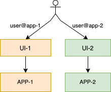
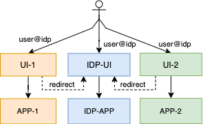
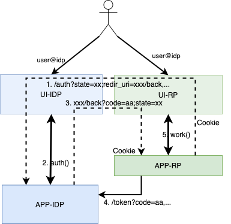

# Open Banking and the Complexity of User Agent Redirection

## Abstract

The sharing of user identity is being intensively used among online service providers to reduce the quantity of accounts managed by a single user. User agent redirection based identity sharing like oAuth2, OpenId Connect has been dominating the scene.

Platform business is generally characterized by multiple applications that collaborate with each other by the mean of sharing data and functionality to provide more valuable services. COllaboration pattern in platform business is also being driven by identity sharing schemes.

### Sharing is not an Option
Open Banking initiatives have been evolving across the globe. A PFM (Personal Finance Manager) application will load user banking transactions and analyze them to help the user have a better insight on his financial activities. As user banking transaction data are held by the bank, data sharing will occur by the mean of the user allowing his bank to share his banking transactions with the PFM provider. Most Open Banking interaction patterns are designed to leverage user agent redirection based identity sharing to design the sharing of banking data and functionalities.

In some regions, the sharing of user banking access is driven by regulators mandating custodians (Banks) to share access to user banking data at user's will with third parties providers (See European PSD2).

In some other regions, data sharing initiatives extends their scope to many other business domains like telecommunication, health, utilities (See Australian CDR).

### Sharing User's Banking Access is not New
Although sharing data has always been practiced in the business environment (see EBICS), the novelty here is the capacity of ad-hoc online connectivity of business, that strive to enable data sharing without time expensive preceding offline authorization steps at the agency location of the custodian. In the case of EBICS, the bank account owner will use an offline channel to have his bank (custodian) explicitly give an authorization to release his data to a designated third party. In a world dominated by real time online access to applications, authorization steps want to be done on the go and in real time. This is why the online platform business community leverages __User Agent Redirection__ to allow for real time online connectivity and interaction between the user and many participating service providers.

### The Challenge
Independent on whether the __User Agent Redirection__ is being used for online real time identity sharing or for more advanced authorization frameworks, it is essential to make sure that the natural person being redirected from one application to another to express his will __can not be impersonated__ by any mean (technical or social engineering).

The use of __User Agent Redirection__ for sharing access to banking services will increase the incentive of malicious parties for investing more effort into exploiting loop wholes. Among malicious parties we account:
- Attacker having an interest in executing fraudulent banking transactions
- Companies financing malicious operations with the intention of illegally accessing banking transaction of competitor for industrial espionage.
- Country driven cyber-attack with the purpose of gaining information on the financial behavior of citizen of other countries.

### The Purpose
The purpose of this work is to give a small insight to the complexity associated with a secure implementation of user agent redirection based data sharing. 

The current state of the implementation Open Banking shows that neither financial institutions (known as ASPSP) nor third party providers (AISP, PISP) are experienced enough to implement and operate solid and tamperprooved implementations of User Agent Redirection based Open Banking sharing processes.

## User Agent Redirection Based Sharing of Identity

### Common Terms
Let's call:
- __APP-RP :__ the ser er application of the relying party that redirects the user to the identity provider,
- __UI-RP :__ the user agent used by the user to access the server application of the relying party,
- __UI-IDP :__ the user agent used by the user to access the identity provider,
- __AUTOMATIC_REDIRECTION :__ a situation in which the UI-RP __automatically__ presents the UI-IDP to the user. This generally happens when UI-RP and UI-IDP are on the same user device.
- __MANUAL_REDIRECTION :__ a situation in which the UI-RP __instructs__ the user to open the UI-IDP. Even if a push notification is used to help the user activate the UI-IDP, we consider it a manual redirection.
- __AUTOMATIC_TRSP_MESSAGE :__ a message automatically transported from the APP-RP to APP-IDP or vice versa, without explicit intervention of the user. E.g.:
  - A query parameter attached to the redirection URL (redirect_uri, code, ...)
  - An information carried by the push notification sent to activate the UI-IDP.
- __MANUAL_TRSP_MESSAGE :__ a message explicitly collected from the UI-RP and input into the UI-IDP (or vice versa) by the user. E.g.:
  - A user using the UI-IDP to scan a QR-CODE displayed by UI-RP;
  - A user sharing an image from the UI-RP to the UI-IDP;
  - A user reading a  number from UI-IDP and typing it into UI-RP.

### Redirection Based Sharing of Identity
An online business service provider generally implements functionality using clients and server side applications. It doesn't matter if biggest part of the application is run on the client side (UI) or on the server side (APP), both sides are generally found in almost all online business applications. The typical design of an online business application looks like:

Each application (APP) presents a user agent to the user. The identifier user@app-1 is used by APP-1 to manage the session between the UI-1 and APP-1 (resp. user@app-1 for UI-2 and APP-2). The following picture shows the delegation of identity management to an identity provider.

In this case, APP-1 and APP-2 delegate authentication to the same identity provider and thus share the same identity (user@idp). Each delegation process generally involves redirection. In order to make sure that redirection based delegation process will not lead to an impersonation of the user, well defined protocols like oAuth2 are adopted by a wide part of the market. Nevertheless, even the most secure identity providers will not prevent badly connected applications (relying party) to offer space for the impersonation of the end user. The following picture displays a classical oAuth2 authorization code workflow.

The workflow displayed above shows an identity sharing process bases on oAuth2. Nothing states that both UI applications are on the same user device. In the rest of this document, we will assume __AUTOMATIC_REDIRECTION__ when both UI-RP and UI-IDP are on the same device and __MANUAL_REDIRECTION__ when both are not on the same device.

### Automatic Redirection to the Identity Provider
This is a situation in which the UI-RP __automatically__ presents the UI-IDP to the user. This generally happens when both UI-RP and UI-IDP are on the same user device, even if they are not in the same web browser. There are many technologies used to enable automatic redirection on devices.
- HTTP redirect (HTTP-302/-303) are used to automatically instruct web browser to redirect the user to another page.
- HTTP accept (HTTP-202) can also be use with native mobile applications and browser based single page applications to instruct UI-RP to redirect the user to UI-IDP. 
- __iOS Universal Link__ and __android App Links__ are used by the corresponding operating systems to automatically launch the target UI (either UI-RP or UI-IDP).

The authorization flow starts by the mean of the relying party (RP) redirecting the user to the identity provider (IDP). As we see on the picture above, the source of the redirection would like to transport some information to the target of the redirection. The way information is transported highly depends on the nature of the redirection.

In the case of __AUTOMATIC_REDIRECTION__, information are transported as URL parameters. We have to be aware that there is no way to protect information transported from a UI application to another UI application on the user device. Any of those parameters can be modified by malicious program code running on the user device. In order to prevent modification of redirected parameter information, oAuth can be extended with an initiation step that will simplify implementation and increase robustness of the oAuth protocol. This is the approach suggested in [draft-ietf-oauth-par-00](https://tools.ietf.org/html/draft-ietf-oauth-par-00).

If we do not have an initialization step and as we know there is no way to control the integrity of an information passed by one UI application to another one on a user device, some technical protection means must be used to make sure the control will not be returned to the wrong UI application (modified redirect_uri). The type of protection used depends on the nature and the purpose of the information: 

- The __redirect_uri__: is used to instruct the identity provider (IDP) on where to send the user back after authentication and authorization is done. If this information is changed on the way to the IDP, there is a risk the IDP redirects control back to the wrong user agent. If the flow is not using an initialization step, the pre-configured URL-Template will have to be registered by the relying party (RP) with the IDP before any interaction happens.

- The __state__: is generally used to hold the state of the user agent of the relying party (UI-RP) during a redirection process. The state can be used by the UI application to help recover persistent information associated with the redirect process.

### Manual Redirection to the Identity Provider
Let assume the user agent of the identity provider (UI-IDP) is a NativeApp and the server application of the relying party (APP-RP) suspects the identity of the user is (user@idp), then the redirection can occur by the mean of APP-RP instructing APP-IDP to send a push notification to UI-IDP. The user will then manually touch the notification message to open UI-IDP and identify with APP-IDP.

This initiation of a __MANUAL_REDIRECTION__ can be perceived as an initiation step as well. Despite the case of a automatic redirection, the presence of a suspected user@idp is necessary to discover the device on which to proceed with the authorization.

A manual opening of the UI-IDP indicates by no mean that the user is in control of both UI-RP and UI-IDP. In order to make sure the user controls both environments, it is necessary to have the user manually collect some information displayed by the UI-RP and enter them in the UI-IDP. We call this __Device Linking__. The way the display and collection process works depends on the nature of both UI-RP and UI-IDP.
- If for example the UI-RP is a browser application running on a desktop computer and the UI-IDP is a NativeApp running on a mobile phone, the UI-IDP can provide tools for __scanning a QR_CODE__ displayed by the UI-RP.
- The UI-IDP might as well just request the user to enter a sequence of digit displayed by the UI-RP.
Again, __linking devices__ in manual redirection case is essential to make sure the same user is in control of both UI-IDP and UI-RP.

### Automatic Return of Control to the Relying Party
The user uses UI-IDP to authenticate with the APP-IDP and there is a session between UI-IDP and APP-IDP. The IDP must return control to the relying party so RP can assert user identity and proceed with the service request.

In an __AUTOMATIC_REDIRECTION__ case, where UI-IDP and UI-RP are on the same device, a technical redirect can be used to send control back to RP. As describe above HTPP 302/303/202, Universal Links and App Links are all means used to automatically pass control from one application to another one. As these technical methods are all URL based, URL parameters can be used to transport information to the UI-IDP. We also mention above that there is no way to control the integrity of an information passed by one application to another one on a user device. The IDP generally sends two information back to the RP:

- The __state__ parameter sent back as received by the IDP and used to validate that control was sent back to the UI instance that initiated the authentication flow.
- The __code__ parameter sent by the IDP and used by the RP to retrieve the final authorization token.

### Manual Return of Control to the Relying Party
A manual return of control to the relying party (RP) can happen in the background by having the APP-IDP produce the token and send it in a back channel to the RP, and makes it the responsibility of the APP-RP to activate the UI-RP, as there an active session between APP-RP and UI-RP.

## Securing Automatic Redirection
An automatic redirection from the relying party (APP-RP) to the identity provider (APP-IDP) for the purpose of collecting user authorization is associated with a lot of risks.

For better illustration, let's call:
- Alice: the honest person owner of an account with the IDP
- Bob: the melicious person trying to gain control on the identity of Alice
- UI-RP-Alice: The user agent used by Alice to Access the relying party server application (APP-RP)
- UI-IDP-Alice: The user agent used by Alice to Access the server application of the identity provider (APP-IDP)
- UI-RP-Bob: The user agent used by Bob to Access the relying party server application (APP-RP)

Bellow is a non exhaustive list of topics of concern while using automatic redirection to collect the Alice's authorization.

### Session Fixation Attack
A well known attack is having a Bob start a session with the relying party (UI-RP-Bob -> APP-RP) and trick Alice to use the redirect url to start an authorization session with the identity provider (UI-IDP-Alice -> APP-IDP).

Some framework will allow UI-RP-Bob to simply poll for completion of the authorization request and proceed forward when Alice has provided her consent (UI-IDP-Alice -consent-> APP-IDP). This is an obvious flaw in the authorization flow as Bob will gain control to the session as soon as Alice provide her authorization to the IDP.

In order to make sure authorization being performed by Alice (UI-IDP-Alice -> APP-IDP) was really initiated by Alice (UI-RP-Alice -> APP-RP) and not by Bob (not[UI-RP-Bob -> APP-RP]), APP-IDP has to auto redirects control to APP-RP through Alice UIs (APP-IDP -> UI-IDP-Alice -> UI-RP-Alice -> APP-RP). This redirection must carry an authorization code that is used by the relying party to collect the token from the identity provider in the back channel( APP-RP -authCode-> APP-IDP). 

### Open Redirector
In order for Bob to gain access to the authorization code, UI-RP-Bob needs to have modified the redirect_uri of the authorization request to include an open redirector hack (see [CWE-601](https://cwe.mitre.org/data/definitions/601.html)).

Preventing Bob from gaining access to the authorization code boils down to making sure the redirect_uri processed by the IDP-APP in sanitized. This requires the effort of both, the IDP-APP and the RP-APP:
- If RP-APP can use an initiation step, see [draft-ietf-oauth-par-00](https://tools.ietf.org/html/draft-ietf-oauth-par-00), it can make sure the redirect_uri is sent to the APP-IDP via the back channel initiation request and does not contain any malicious query parameter controlled by the UI.
- If the redirect_uri has to be transported to the IDP-APP through the UI's, there is no way to prevent UI-RP-Bob from manipulating it. In this case, APP-IDP will have to :
  - check the redirect_uri provided with the authorization request against open redirect patterns before proceeding with the authorization, and 
  - validate that the redirect_uri provided with the authorization request matches the redirect_uri provided with the token request performed in the back channel before issuing the token.

### Browser Interception Attack
In order to make sure authorization process was started by UI-RP-Alice, APP-IDP will return control to APP-RP by redirecting the authorization response to APP-RP through Alice UIs (APP-IDP -> UI-IDP-Alice -> UI-RP-Alice -> APP-RP). The authorization code associated with this back redirect is used by the APP-RP to recover the authentication token from APP-IDP through the back channel.

Although "APP-IDP -> UI-IDP-Alice" and "UI-RP-Alice -> APP-RP" are protected by TLS, authorization code can be intercepted on the link "UI-IDP-Alice -> UI-RP-Alice". This can be done by another application registered for the URL of UI-RP on Allice device (attack well explained in [PKCE RFC7636](https://tools.ietf.org/html/rfc7636)). Authorization code can be intercepted on Alice device by other means as we can not control the state of a client device. 

### Counter-Measure: User Agent Binding
While initiating redirection to APP-IDP, APP-RP can set a RedirectCookie with UI-RP-Alice (including the associated XSRF-Token). This RedirectCookie is physically bound to the user agent UI-RP-Alice.
- If the redirection is performed using HTTP-302/-303, the XSRF protecting the RedirectCookie must be stored in the state parameter associated with the redirect_uri. 
- If the redirection is performed using HTTP-202, the XSRF parameter can be held in the local/session storage of UI-RP-Alice before forwarding control to UI-IDP-Alice (beware  of the origin policy while keeping object in local/session storage).
- Native Applications have a better control on the persistence and protection of those Cookies and Tokens.

While redirecting back from APP-IDP (APP-IDP -> UI-IDP-Alice -> UI-RP-Alice -> APP-RP), APP-RP will only accept the redirect code if UI-RP-? provides the original RedirectCookie (And corresponding XSRF parameter). With this approach intercepting the authorization code will not help, as UI-RP-Bob will not have access to information stored by UI-RP-Alice.

Note that PKCE is not designed to solve this problem.

### Malicious Relying party 
Bob could install a relying party (APP-RP-Bob) that can impersonate the original APP-RP to request token on it's behaves. Recall that most relying party server  application will be deployed by company with not enough experience in application security. So stealing static configuration information like the client-secret wont be a major issue for well trained attackers.

In order to prevent a malicious RP (APP-RP-Bob) from using an intercepted authorization code to obtain the token, IDP and RP can be required to implement server side [PKCE RFC7636](https://tools.ietf.org/html/rfc7636). The advantage of PKCE over classical RP authentication information is that the client-secret (and  other APP-RP credentials) are static while generated code_verifier are dynamic and vary with each authorization request. 

## Conclusion

### Ignoring the Implicite Flow
The oAuth2 framework defines many models of interaction between IDP and RPs. This work deals only with the authorization code flow, as market initiatives like the [OpenID Financial-grade API](https://openid.net/wg/fapi/) explicitly discards the oAuth2 implicit flow for open banking processes.

### The oAuth2 Password Grant Flow
The password grant flow is one that allows a relying party to collect user credentials and forward them to the identity provider. From a technical perspective, this flow seems to be the simplest as it involves no redirection.

The oAuth2 Password Grant Flow exposes static user credentials to the RPs raising a issue hard to deal with as we know that the user password is not supposed to be shared with third parties.

### Open Banking Embedded Approach
The European PSD2 initiative includes a sharing alternative called "Embedded Approach". This alternative allows the third party provider (RP) to collect user credentials (user banking password and transaction numbers) and forward them to the user's banking service provider.

Despite the oAuth2 password grant, the PSD2 embedded approach mandates a second factor which is a one time password inherently bound to the transaction being authorized (or the consent being given). With the sexcond factor as enhancement and the requirement of implementing that second factor for login into banks native online banking applications, disclosing the online banking password of the banking users to third party banking service providers (TPP) seems to be a lees risker alternative than having banks and TPPs implement technical redirect based solutions they can't control.

### Outlook
This work intentionally ignored the user experience perspective as the purpose was to highlight the complexity associating with implementing redirect flows. 

Our final recommendation is (in regulated initiatives) to mandate the Open Banking Embedded Flow:
- as this simple and is well understood by today's bank as it is closest to their native online banking interfaces,
- as this will free banks from having to implement and operate redirect processes without having gone through the experience of operating a redirection based identity provider,
- as this will release TPPs from the obligation of implementing complex and error prone redirect processes. 

