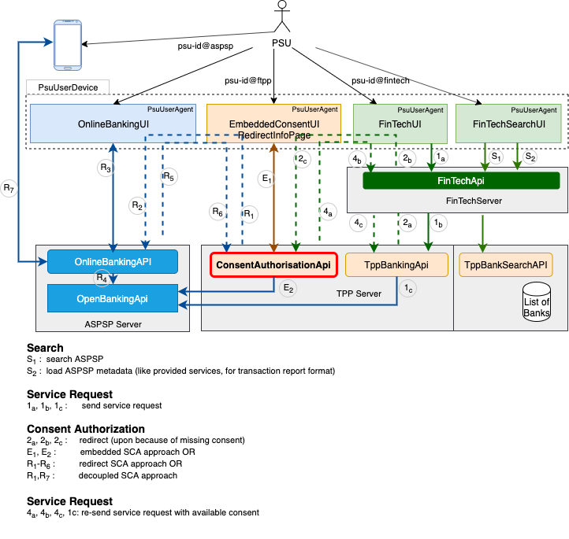

# PSU Access Security Design

## <a name="OpenBankingPsuContract"></a>Abstract
We define the __OpenBanking PSU Contract__ as a relationship between the __[PSU](psu-security-concept.md#PSU)__, the __[FinTech](psu-security-concept.md#FinTech)__, the __[TPP](psu-security-concept.md#TPP)__ and the __[ASPSP](psu-security-concept.md#ASPSP)__ so that:
- the __PSU__ can initiate banking/payment services through an application provided by the __FinTech__, and for this purpose,
- the __PSU__ can __authorize__ the __TPP__ to service this initiated payment/banking requests from a designated __FinTech__ on behalf of the PSU, and for this purpose,
- the __PSU__ can __authorize__ the __ASPSP__ to service this initiated payment/banking requests from a designated __TPP__ on behalf of the PSU.

This is, the PSU might be interacting with up to three different legal entities to consume a single banking/payment service (FinTech, TPP and ASPSP). Therefore, the entire OpenBanking service flow involves the initiation, authorization and confirmation of the banking/payment service. The integrity of the entire service flow is only given if we can verify that:
- the PSU __that controls the credentials__ used to identify at the __FinTech interface__ and initiate a banking/payment service at that __FinTech interface__ is the __same natural person__ as the PSU that controls the credential used to identify at the TPP interface for the purpose of authorizing __that initiated banking service__, and that 
- the PSU that controls the credentials used to identify at the TPP interface __for the purpose__ of authorizing an initiated banking service is the same natural person as the PSU that controls the credentials used to identify at the ASPSP interface with the purpose of authorizing that initiated banking service at the ASPSP interface, and that
- the PSU that controls the credentials used to identify at the ASPSP interface and authorize an initiated banking service is the same natural person as the PSU that finally identifies at the FinTech interface to confirm __that authorized__ banking/payment service.

We call this relation the __PSU identities equivalence__. This is, ensuring integrity of the overall PSU OpenBanking service flow boils down to the __verification of the equivalence__ of involved PSU identities (psu-id@fintech ==> psu-id@tpp ==> psu-id@aspsp).

Therefore, the purpose of this work is to analyze interactions to be performed between a PSU and those three legal entities while initiating, authorizing and confirming a banking/payment service, and then provide recommendations on how to secure those interactions such as to maintain the integrity of the banking service consumed. 

The following picture depicts participants and interfaces used in this concept.



## Core Participants

### <a name="PSU"></a>PSU
A Payment Service User is any natural person that uses a banking or payment service on behalf of himself or on behalf of another natural person or legal entity.
Form the perspective of this analysis, a PSU:
- is a natural person,
- is in possession of some personal non sharable online banking credentials,
- uses applications running on some devices to interact with online services,
- can act on behalf of himself, another natural or legal person,

### <a name="ASPSP"></a>ASPSP
An Account Servicing Payment Service Provider is a legal entity maintains payment account for natural and/or legal person.

Form the perspective of this analysis, an ASPSP:
- might provide an online interface for use by a PSU to authorize a consent (OnlineBankingApi),
- might provide an application for use by the PSU to access the OnlineBankingApi (OnlineBankingUI), 
- provides an online interface for use by a TPP for online access to banking services (OpenBankingApi),
- might provide an online interface for use by a TPP to forward PSU consent authorization to the ASPSP (OpenBankingApi)

The __psu-id@aspsp__ is the identity of the PSU as known to the ASPSP. This identity generally matches an online banking identifier in the realm of the ASPSP.

### <a name="TPP"></a>TPP
A Third Party Provider is a legal entity that implements access to ASPSP OpenBanking interfaces. A TPP is a regulated entity that implements legal provisions to protect PSU banking data obtained from OpenBankingApis. Market practices show that some TPPs are setup to service other entities (FinTech) with access to banking services.

Form the perspective of this analysis, a TPP:
- provides an online interface for the management of PSU consents (ConsentAuthorisationApi)
- provides an application for use by the PSU to authorize consent in the embedded approach (EmbeddedConsentUI). This same application can also be used to present redirect info pages to the PSU (RedirectInfoPage).
- provides an online interface for use by a FinTech to access banking services (TppBankApi, TppBankSearchApi),

The __psu-id@tpp__ is the PSU as known to the TPP. If TPP environment is designed to service a single FinTech, this identity can be set equal to the __psu-id@tpp__.

If a TPP environment services multiple FinTech entities, the TPP will have to establish a separated PSU identity that references all corresponding FinTech identities. This requirement only exists because some OpenBanking specifications do not allow TPP to maintain multiple valid consents of the same type on the same bank account.

In a situation where the TPP uses the same account information consent to service many FinTech, a TPP consent management layer must allow a PSU to revoke that consent for a designated FinTech without revoking the consent at the ASPSP level. 

### <a name="FinTech"></a>FinTech
A FinTech is a legal entity that provides some sort of aggregated online banking/payment services to other natural and legal people.

From the perspective of this analysis, a FinTech:
- provides an online interface for use by a PSU to access banking services (FinTechApi),
- provides an application for use by the PSU to consume banking services (FinTechUI, FinTechSearchUI).

The __psu-id@fintech__ is the identity of the PSU in the realm of the FinTech, as most FinTech applications require the PSU to establish an identity before using the application. This is the most important identity as it covers the consumption of the banking/payment services. Further identities (tpp, aspsp) are only needed for authorization. 
This framework is designed such as to request the FinTech to provide a permanent unique identity of each PSU to the TPP.

## <a name="PsuUserDevice"></a>PsuUserDevice
A PsuUserDevice runs applications used by the PSU to access banking services. Those applications are generally called PsuUserAgents. Sample PSU user devices are Personal Computers, Mobile Phones or even SecureId Token devices.

### <a name="PsuUserAgent"></a>PsuUserAgent
A PsuUserAgent is an application running on a PsuUserDevice and used by the PSU to access banking functionality. PsuUserAgents are either web applications running on a standard web browser or native applications.

A web browser is considered compliant with this framework when :
- it can protect access to cookies.
- it can manage redirection as defined by the http specification.

For uniformity, we require native applications considered to be compliant with this framework to provide the same behavior as a compliant web browser based PsuUgerAgent with respect to cookie management and redirection. Following specifications deal with security threads associated with the redirection between UI-Applications on a PsuUserDevice: 
[RFC8252:OAuth 2.0 for Native Apps](https://tools.ietf.org/html/rfc8252), 
[RFC7636:Proof Key for Code Exchange by OAuth Public Clients](https://tools.ietf.org/html/rfc7636).

### <a name="UserAgentContext"></a>UserAgentContext
Independent on the type of PsuUserAgent, OpenBanking interfaces will require transmission of a class of information associated with the PsuUserAgent so they can perform verification of the authenticity of the original PSU request and customize the response produced for intermediary layers. We group these data under the name "UserAgentContext". Following header names are among the UserAgentContext: IP-Address, IP-Port, Accept, Accept-Charset, Accept-Encoding, Accept-Language, Device-ID, User-Agent, Geo-Location, Http-Method.

## Security Considerations
This work deals with details associated with the verification that the natural person that controls credentials used to authorize the initiation of a banking service at the TPP or ASPSP interface also controls credentials used to initiated that service at the FinTech interface. This is, we want to prevent the owner of some online banking credentials to involuntarily use them to authorize a banking service initiated by another natural person.

### <a name="Cookies"></a>Cookies
The first measure consists in protecting a session established between a PsuUgerAgent and a ServerApplication (FinTechApi, ConsentAuthorizeApi).

The use of [Cookies RFC6265](https://tools.ietf.org/html/rfc6265) provides the most elaborated way to protect a session established between a PsuUgerAgent and a ServerApplication. We assume a PsuUgerAgent storing a cookie fulfills following requirements:
- Cookies carrying the attribute __HttpOnly__ are not provided access to scripts run by a web browser based UserAgent. Native applications designed for banking services must undergo through security reviews to make sure they fulfill this requirement.
- Cookies carrying the attribute __Secure__ are only sent to the server over SSL connections.
- Expired Cookies (attribute __Expires, Max-Age__) are not sent to the server.
- Cookies set with no value (__SessionCookie=;__) are deleted from the UserAgent.
- Cookies shall never be transmitted to a domain not matching it origin.
- In the same domain, cookies shall only be transmitted to the configured path.

#### <a name="SessionCookie"></a> SessionCookie and XSRF
We assume all three applications FinTeApi, ConsentAuthorisationApi, OnlineBakingApi maintain their own session information with corresponding UIs. We assume those APIs use cookies to maintain session with the corresponding PsuUserAgents. In the context of this framework, those cookies are called SessionCookies. We also expect a following behavior from APIs and UserAgents:
* A response that sets a SessionCookie also carries a corresponding X-XSRF-TOKEN in the response header.
* A request that authenticates with a SessionCookie must also add the X-XSRF-TOKEN to the request header.
* Server must match X-XSRF-TOKEN against SessionCookie before proceeding with the request.

### <a name="Redirection"></a> Redirection
The server can request the PsuUgerAgent to redirect the user to another application by returning an "HTTP 302" response code to the PsuUserAgent. The way a PsuUserAgent proceeds with a location URL depend on the nature and the configuration of the host PsuUserDevice. The handling of redirection in native applications environments is well handled in __[OAuth 2.0 for Native Apps RFC8252](https://tools.ietf.org/html/rfc8252)__.
 
We will be using redirection to switch the user context from one application to another one. Following redirection will generally be found in this framework:
- FinTechApi to-> ConsentAuthorisationApi
- ConsentAuthorisationApi to-> OnlineBankingApi
- OnlineBankingApi backTo-> ConsentAuthorisationApi
- ConsentAuthorisationApi backTo-> FinTechApi

We assume all three ServerApplications (FinTechApi, ConsentAuthorisationApi, OnlineBankingApi) are hosted on different domains. This is, we do not expect cookies set by one ServerApplication to be visible to another ServerApplication.

We assume UiApps (OnlineBankingUI, EmbeddedConsentUI, FinTechUI/FinTechSearchUI) do not share context information. They can only interact with each other by the way of the hosting PsuUserDevice using the URL provided by the source UiApp to open the target UIApp.

#### Redirection and XSRF
As we can not protect/control redirection on user device, known internet based identity protocols like oAuth2 make use of the __state__ parameter to store information that will be sent back to the redirection source and used by the redirection source to verify that the user was sent back to the original source UIApp.
This is, implementing XSRF for redirection consists in storing a RedirectCookie in the source UIApp and adding a corresponding XSRF-Token to the state parameter.

#### Redirection and Data Sharing
We also do not advice adding too many persistent information to the redirection URL, as these are all logged in files everywhere on infrastructure components in data centers. If we have any bulky information to share between the source UIApp and the target UIApp, we can add a __OneTime__ and __ShortLived__ authorization code we called __redirectCode__ to __RedirectUrl__. This redirectCode can be used at target to retrieved shared payload (generally through an authenticated back channel connection). This is the practice borrowed from [oAuth2 RFC6749](https://tools.ietf.org/html/rfc6749).

## <a name="SecurePsuConsent"></a>Identity Equivalence
When a PSU initiate a banking service at the FinTech interface (FinTechApi), the processing TPP will initiate a consent authorization process if needed (TppBankingApi). Once a consent authorization process is initiated by the TppBankingApi, we want to make sure that the PSU giving his consent (psu-id@tpp, psu-id@aspsp), is the same as the PSU requesting the service at the FinTech interface (psu-id@fintech).

Ensuring the equivalence of those identities can be represented as (assuming alice and bob are PSUs):

```
alice@fintech ==> alice@tpp ==> alice@aspsp 

// Where alice@fintech ==> alice@tpp neans the person identified at the FinTechApi as alice@fintech controls the necessary credentials used to identify at the ConsentAuthorisationApi as alice@tpp
```
This is, the integrity of the OpenBanking PSU Contract is broken when security breaches can be used to compromise these equivalences like in the following pseudo code:

```
bob@fintech ==> alice@tpp ==> alice@aspsp 
// although in reality  bob@fintech =/=> alice@tpp 
// In this case bob identifies with the FinTechApi (as bob@fintech) but manipulates alice to identify with the ConsentAuthorisationApi and provide her consent for the requested banking service. 

bob@fintech ==> bob@tpp ==> alice@aspsp 
// although in reality  bob@tpp =/=> alice@aspsp
// In this case bob identifies with the FinTechApi and the ConsentAuthorisationApi but manipulates alice to identify with the OnlieBankingApi and provide her consent for the requested banking service. 
```
### Step-1: Identify PSU at the FinTechApi
We always expect the PSU to be identified at the FinTechApi interface. So we assume that the psu-id@fintech is known. The integrity of the rest of the contract relies on the capability of the FinTech to protect the session associating the PSU to the FinTechApi.

The service request itself is always initiated by the FinTechApi. Before initiation, we assume that the PSU (alice) has signed into the FinTechApi and her identity is known to the FinTechApi and thus associated with the service request forwarded to the TppBankingApi.

### Step-2: Store psu-id@fintech with the ConsentAuthorizationSession
While processing a service request, if the TPP notices that the service request is not covered by a consent (either as a result of pre-checking for the consent or from an error returned by the ASPSP's OpenBankingApi), the TPP will trigger a new consent authorization process identifies by an __auth-id__ and called __ConsentAuthorizationSession__. 

Starting a new ConsentAuthorizationSession, we require the TPP to store the FinTech identity of the service requesting PSU alice@fintech with the ConsentAuthorizationSession record before initiating a redirect to the ConsentAuthorisationApi. This is, the ConsentAuthorizationSession record stored in the TPP Database has the state: 

```
// Syntax: [index+]=ConsentAuthorizationSession[data]
[auth-id,redirectCode]=ConsentAuthorizationSession[auth-id,redirectCode, alice@fintech, ConsentData]
// Where redirectCode is a one time key that can be used by the ConsentAuthorisationApi once to retrieve the ConsentAuthorizationSession.
// Where auth-id is the identifier of this ConsentAuthorizationSession
```

### Step-2: Identify PSU at the TPP ConsentAuthorisationApi 
At first, redirecting a PSU from the FinTechApi to the TPP ConsentAuthorisationApi does not establish any relationship between the PSU and the TPP, even if we can use the redirectCode associated with the redirected URL to retrieve ConsentAuthorisationSession. Of course the ConsentAuthorisationApi knows that the ConsentAuthorizationSession was initiated by alice@fintech, but this does not mean that the PSU controlling the current PsuUserAgent (known as ConsentAuthorisationUI) is the same natural person as the one controling the identity alice@fintech. 

In order to proceed with the ConsentAuthorisationSession, the TPP ConsentAuthorisationApi will have to establish an identification of the natural person controlling the UserAgent, resulting in a new PSU identity called (psu-id@tpp). This PSU identity (psu-id@tpp) is associated with the ConsentAuthorisationSession upon successful authentication of the PSU at the TPP ConsentAuthorisationApi interface. At this stage, the ConsentAuthorizationSession record stored in the TPP Database has the following state: 

```
[auth-id,redirectCode]=ConsentAuthorizationSession[auth-id,redirectCode, alice@fintech, alice123@tpp, ConsentData]
// But with the assumption that alice@fintech =/=> alice123@tpp. 
// Meaning that both identities are not yet verified equivalent (controlled by the same natural person)
```
Even though the ConsentAuthorizationSession in the TPP database is associated with two identities (alice@fintech and alice123@tpp), there is no proof that both identities alice@fintech and alice123@tpp are controlled by the same natural person.

### Step-3a: ConsentAuthorisation at the TPP's ConsentAuthorisationApi (Embedded-sca)
In an Embedded-SCA case, the credentials associated with psu-id@aspsp are collected by the ConsentAuthorisationApi and forwarded to the OpenBankingApi of the ASPSP. In this case it is easy to assume uniqueness between both psu-id@tpp and psu-id@aspsp as both are done within the same user session at the same interface. This results in the following record after a successful embedded consent authorization at the ConsentAuthorisationApi:

```
[auth-id,redirectCode]=ConsentAuthorizationSession[auth-id,redirectCode, alice@fintech, alice123@tpp, alice-s@aspsp, ConsentData, alice123@tpp==>alice-s@aspsp]
// Where alice@fintech =/=> alice123@tpp. // Meaning that both identities are not yet verified equivalent (owned by the same natural person)
// Where alice123@tpp ==> alice-s@aspsp. // Meaning alice123@tpp could provide the banking credentials of alice-s@aspsp.
```
Even in this embedded case, there is still a missing equivalence between __alice@fintech__ and __alice-s@tpp__.

### Step-3b: Identify PSU at the ASPSP's OnlineBankingApi (Redirect-sca) 

In a Redirect-SCA case (oauth, redirect, decoupled), the PSU has to be redirected by the ConsentAuthorisationApi to the OnlienBanking interface of the ASPSP. After a successful consent authorization at the OnlienBanking interface, the record could be updated by the mean of poling the authorization status of this ConsentAuthorizationSession at the OpenBankingApi of the ASPSP. Upon successful authorization of the requested consent, the ConsentAuthorizationSession in the database of the TPP looks like:   

```
[auth-id,redirectCode]=ConsentAuthorizationSession[auth-id,redirectCode, alice@fintech, alice123@tpp, alice-s@aspsp, ConsentData]
// Where alice@fintech =/=> alice123@tpp. // Meaning that both identities are not yet verified equivalent (owned by the same natural person)
// Where alice123@tpp =/=> alice-s@aspsp. // Meaning that both identities are not yet verified equivalent (owned by the same natural person)
```

### Step-4: Verify Equivalence between psu-id@aspsp and psu-id@tpp (Redirect-sca)
After a successful consent authorization at the OnlineBankingApi of the ASPSP, the framework has to ensure equivalence between the PSU identified at the TPP and the PSU identified at the ASPSP.

In this framework, we designed a two steps redirection FinTech -> TPP -> ASPSP knowing that this might make the process more cumbersome, but this design represents the superset of most of the cases found on the market. After thorough analysis of most scenarios, we noticed that the identity equivalence process can only securely happen in one of these ways:

### Alt-1: Sharing of Identity Provider
If two involved entities (FinTech, TPP, ASPSP) share the same identity provider (IDP), the identity association process will be simple as the IDP will provide a common identifier. For example the subject claim of an identity token could lead to the verification of subject(alice123@tpp)==subject(alice-s@aspsp).

### Alt-2: No Sharing of Identity Provider
If two parties are not sharing identity provider, a __physical back redirection__ from the ASPSP to the TPP must be used to help complete the identity verification. Note that a __physical back redirection__ will not be possible with the decoupled approach.

Following sub-steps will be needed to ensure clean and secure physical back redirection in the example of a redirect from the TPP to the ASPSP:

#### Make sure the physical back redirection sends the PSU to the Source PsuUserAgent
The URL for the __physical back redirection__ must have been protected against manipulation: 
- In case there is an initiation step present between TPP and ASPSP, use this step must have been used to transfer the __back redirection url__ to the ASPSP (this is an example of the redirect approach of the NextGenPSD2 API).
- In case there is no such initiation step (generally when OAuth is being used), make sure oAuth2 __back redirection url templates__ and __webOrigins__ are properly designed, as the concrete __back redirection url__ is transported in the __redirect_uri__ parameter of the consent request and exposed to attackers for manipulations.

#### Verify Redirect State once in the Source PsuUserAgent
- A RedirectCookie must have been set on the PsuUserAgent while redirecting a user from the TPP (ConsentAuthorisationApi) to the ASPSP (OnlineBankingApi).
- The __back redirection url__ to contains contains the state parameter that is used by the source PsuUserAgent to validate stored RedirectCookie. 

If a physical redirect can occur from the ASPSP (OnlineBankingApi) back to the TPP (ConsentAuthorisationApi), __a validation of the original RedirectCookie can be taken as a guaranty to declare equivalence between the psu-id@tpp and the psu-id@aspsp__.

### Alt-3: No Sharing of IDP and Decoupled-sca
We define a decoupled approach as one where there no way of achieving __physical (back) redirection__ between the source UIApp and the target UiApp. This generally happens when both are not on the same physical device. In this case a physical exchange muss happen. This physical information exchange is generally sufficient in one direction as the purpose is to make sure the PSU is physically in control of both devices (and UIApp credentials). Following are among other means for physical information exchange between two devices:

#### Manual Code Transfer
Physical sharing of state information between the source an the target of the redirection can be covered by having one side of the redirect enter a redirectCode displayed by the other side. In this case the redirectCode displayed is the handle for a more complex hash code shared over the back channel between source and target of the redirect.

#### QR-Scan
Physical sharing of state information between the source an the target of the redirection can be covered by having one side of the redirect (camera capable side) the possibility to scan a QR-Code displayed by the other side UIApp. 

#### Push notifications
A push notification could be used to deep link the user into the target decoupled UIApp. To prevent spam, push notification shall only be done if the overall process can provide a sufficient level of confidence that the source side of the redirection identified the PSU before the initiation of the redirection process. The use of push notification can replaces the  manual code or QR-scan described above.

### Limitation of Identity Equivalence for Existing OpenBanking Flows
In some OpenBanking approaches, validating the consent at the OnlineBanking interface of the ASPSP directly finalizes authorization of the service request. The current state of the NextGenPSD2 specification for example finalizes a payment initiation with the act of a PSU authorizing the payment consent (either on the ASPSP or TPP interface), but future release are planing an additional step for the __confirmation of the service request__ at the OpenBanking interface (after authorization). This additional step is necessary for to complete verification of the identity equivalence as described above.

Recall that this weakness is only provided if the consent authorizing interface (OnlineBankingApi for redirect-sca or ConsentAuthorizationApi for embedded-sca) can not establish identity equivalence. Remember that if source and target share the same identity provider, target will generally be able establish identity equivalence and therefore authorized payment initiation can be release for execution without breach of the __OpenBanking PSU Contract__.
