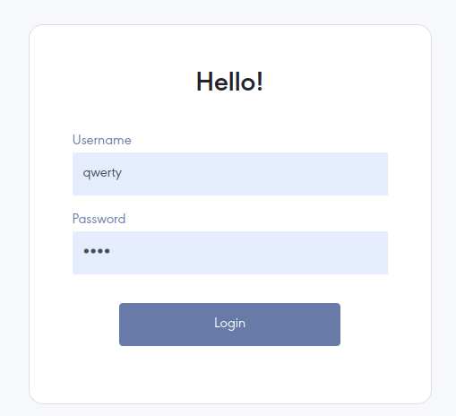
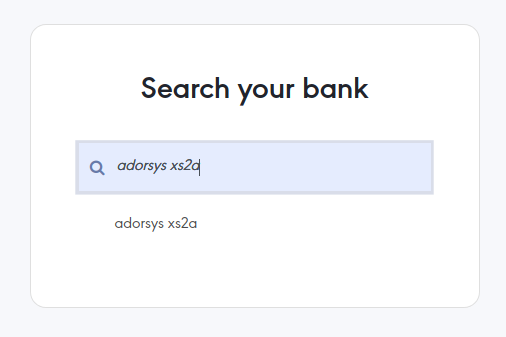
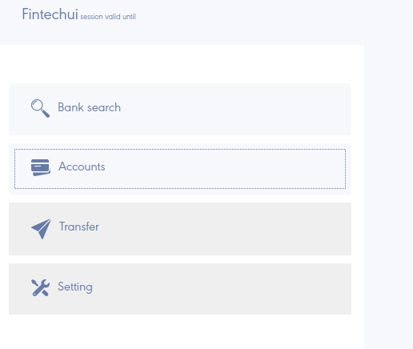
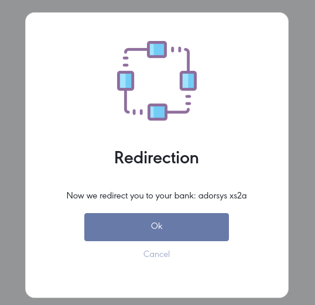
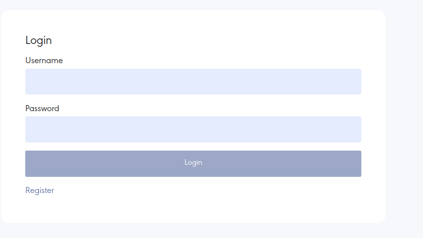
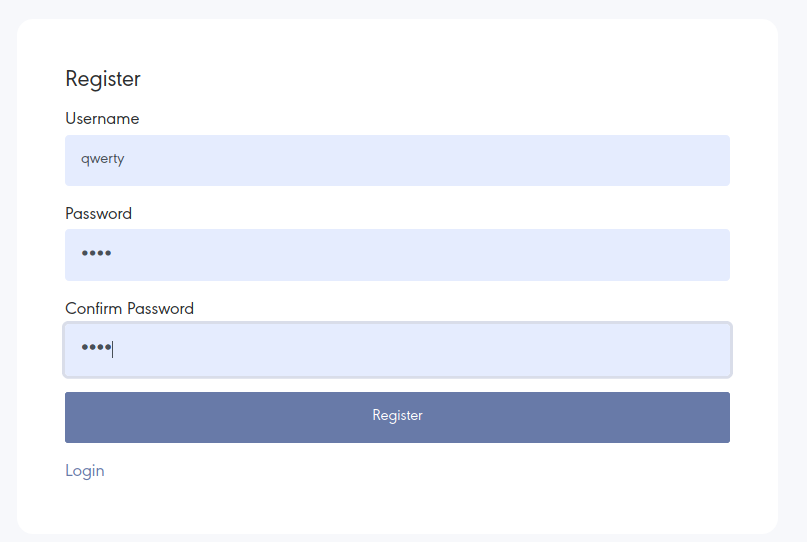
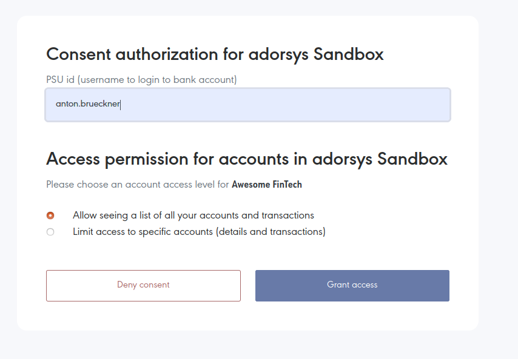
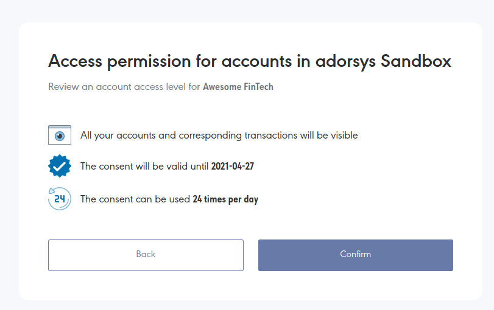
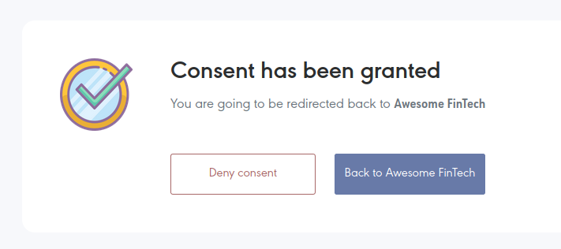
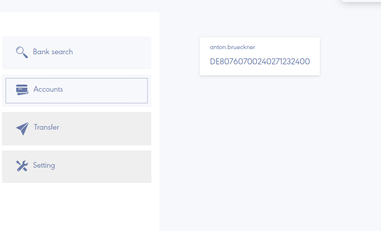

# Introduction

For the project demonstration, we provide you links and guideline of how to use our **DEV** environment.
Please note that as it is **DEV** environment it might get unstable on occasion. 

# Environment details

Our **DEV** environment is configured to use [Adorsys Dynamic Sandbox](https://github.com/adorsys/XS2A-Sandbox) 
that **closely** imitates real ASPSP (Bank) with full set of XS2A-API functionality.

# Environment location and guide

## Location

Environment is hosted at:
[https://obg-dev-fintechui.cloud.adorsys.de](https://obg-dev-fintechui.cloud.adorsys.de)

## Demo video guide

## Guide transcript

### 1. Login to FinTech

When you open [https://obg-dev-fintechui.cloud.adorsys.de](https://obg-dev-fintechui.cloud.adorsys.de) you will
see FinTech example application login screen. It will allow you to use any not-registered user name with arbitrary
4 character password. I.e. type any random username and password '1234'.

### 2. Bank selection

After you log in to the FinTech sample application, you will see bank selection screen there, 
you need to select your bank. Select 'adorsys xs2a'.

### 3. Asking for the account list

On the next screen, you want to see your account and transaction list at the selected bank. Click on
accounts button.

### 4. Redirection to OpenBanking server

FinTech will ask you to redirect to OpenBanking server in order to provide consent to perform account
and transaction listing. Click on the OK button.

### 5. Register in OpenBankingGateway

Because users consent might be shared (if user allows) across multiple FinTechs', you will be
prompted with login screen in OpenBankingGateway.

Click on register button to create new user, you will be prompted with another form. 
Fill username with random username and password i.e. '1234'.

Click on register button, you will be redirected back to login form. 
Fill the login form with credentials you used to register and login.

### 6. Consent scope selection

After you have logged in to OpenBankingGateway, you will see Consent grant screen:

Type 'anton.brueckner' to PSU ID field. Click Grant access.

### 7. Consent review

You will see consent review screen:

Click on confirm button.

### 8. Consent authorization

On the next step you will enter either EMBEDDED consent authorization or REDIRECT consent authorization
that will depend on current ASPSP configuration. All you need is to follow on-screen instructions
and to fill forms with these values:
- login: `anton.brueckner`
- PIN/Password: `12345`
- SCA/TAN challenge result: `123456`

### 9. Redirect back to FinTech

After you have granted the consent you will be redirected back to FinTech:

Click on 'Back to Awesome FinTech'

### 10. Account list at FinTech UI

You will be redirected back to FinTech and you have granted the consent to the FinTech to read your account list.
Click on 'Accounts' button and you will see your accounts (anton.brueckner's accounts):

