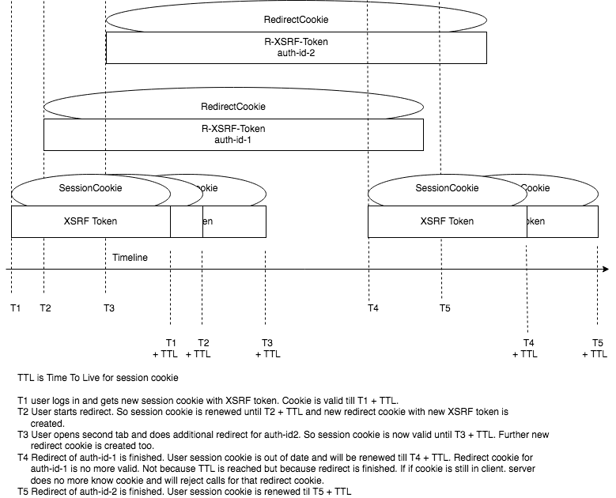

# Session management of Fintech Server

## HOW IT IS NOW

To make it possible to do two redirects in two tabs of same browser the session management of fintechServer is designed in that way, that user always has just ONE valid session cookie but can have more than one valid redirect cookie. As soon, as redirect is started, new redirect cookie is added with particlular path for redirect. So different redirects can be started in parallel. For starting redirect they all use same session cookie and will get individual redirect cookie with long ttl.

As soon as any redirect ends, redirect cookie will be removed and old session cookie is in charge again.

Further each call to the fintech server extends duration of session to new maximum.
Suggest, session cookie has ttl 5 minutes. If user after login is idle for one minute and than does call (for exampl search bank) session cookie is renewed to be alive for new 5 minutes.

In case of redirect it might happen, that during redirect session cookie ttl exceeds. This does not matter as long as redirect returns in ttl of redirect cookie. As soon as redirect is finished, old session cookie is renewed and valid again for 5 minutes.

