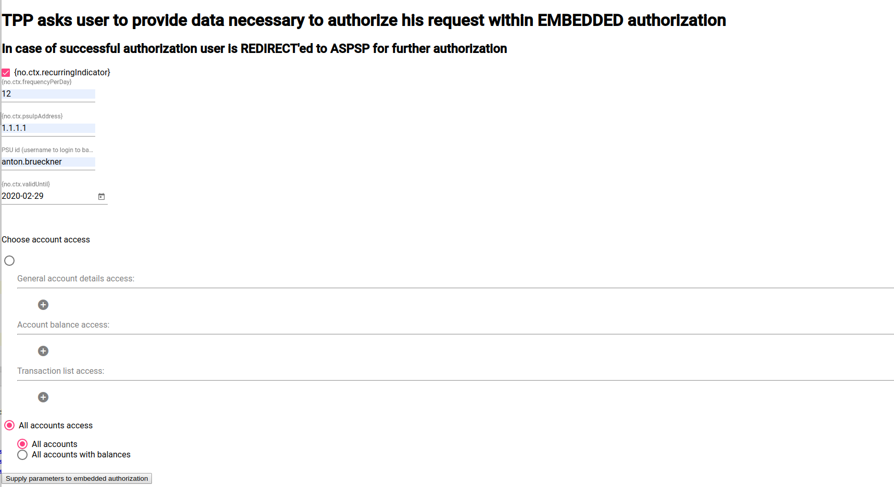

# How to start with project

# Open Banking Frontend 
TBD

# Open Banking Backend and Technical-UI

## Prerequisites

Ensure you have:
 1. Java 8+ JDK
 1. Docker
 1. Docker-compose
 1. For MacOS/Windows users ensure you have allocated at least 4Gb of RAM for docker (this is for XS2A-Sandbox ASPSP (bank) mock):
  - MacOS: https://stackoverflow.com/questions/32834082/how-to-increase-docker-machine-memory-mac
  - Windows: https://stackoverflow.com/questions/43460770/docker-windows-container-memory-limit

## Building and running:

### Without FinTech part using 'Technical UI' to drive backend:

This section is primarily for project-developers. 'Technical-UI' is the stub UI to drive backend.

### Application components:

 1. Open banking backend - 
 [OpenBankingEmbeddedApplication](../opba-embedded-starter/src/main/java/de/adorsys/opba/starter/OpenBankingEmbeddedApplication.java) 
 Spring-boot application.
 1. Open banking technical UI - [technical-embedded-ui](../technical-embedded-ui) developer-only UI to drive backend.
 1. [XS2A Sandbox (XS2A-Dynamic-Sandbox)](../how-to-start-with-project/xs2a-sandbox-only/docker-compose.yml) that mocks ASPSP (bank).
 1. Postgres database (for Sandbox and Open banking backend). 
 **Note that open-banking database data will be persisted across runs in '$HOME/docker/volumes/postgres' if you use scripts below**

### Running backend:
 
There are different ways to run backend:
 1. [Run from IDE](#run-from-ide) - if you want to have access to each component
 1. [Run from terminal using docker-compose](#running-with-docker-compose) - if you are fine with using simple docker-compose file
 1. [Run from terminal using maven](#running-with-maven) - if you want less resource usage

### Run from IDE
In case you have `Node.js (with npm) 12+, angular-cli` installed locally in addition to JDK and Docker, and you want to run 
application directly from IDE, you can follow steps below:

##### 1. Starting only XS2A-Sandbox first

Sandbox can be started using this docker-compose file [xs2a-sandbox-docker-compose](../how-to-start-with-project/xs2a-sandbox-only/docker-compose.yml)

 `cd ../xs2a-sandbox-only; docker compose up`

**Alternatively to docker-compose** you can use 
[BasicTest#startTheSandbox](../opba-protocols/sandboxes/xs2a-sandbox/src/test/java/de/adorsys/opba/protocol/xs2a/testsandbox/BasicTest.java)
which consumes less resources and has advantage of using single JVM for Sandbox.

##### 2. Starting backend and technical-ui next

 1. Start Postgres: `docker run --rm --name opba-pg-docker -e POSTGRES_PASSWORD=docker -e POSTGRES_DB=open_banking -d -p 5432:5432 -v $HOME/docker/volumes/postgres:/var/lib/postgresql/data postgres`
 This database will have admin user postgres/docker when started using aforementioned command and it will be available at `localhost:5432`.
 1. Prepare Postgres (should be done only once) - execute: [open-banking-init.sql](../opba-db/src/main/resources/init.sql) 
 1. Run OpenBanking backend (Spring-boot application) [OpenBankingEmbeddedApplication](../opba-embedded-starter/src/main/java/de/adorsys/opba/starter/OpenBankingEmbeddedApplication.java) 
 with profiles `dev,no-encryption,technical-ui`
 1. Prepare and run technical-ui:
    - Install node modules at [tpp-ui](../technical-embedded-ui/tpp-ui/) 
    
    `cd ../technical-embedded-ui/tpp-ui; npm install`
    - Run technical-ui via [node package.json](../technical-embedded-ui/tpp-ui/package.json)
    
    ` ng serve --port 5500`
 
### Run from terminal

### Running with docker-compose

  1. `cd` to [technical-ui](technical-ui)
  1. Run [01.build.sh](technical-ui/01.build.sh) - build docker images of the required infrastructure
  1. Run [02.launch-from-docker.sh](technical-ui/02.launch-from-docker.sh) or `docker-compose up -e OPBA_PROFILES=dev,no-encryption` in current directory - start the project (in development mode)
  1. Open `http://localhost:5500/initial` in your browser
  
### Running with maven 
**(Sandbox starts in one JVM - less resource usage, also you can debug everything easier)**
  
  1. `cd` to [technical-ui](technical-ui)
  1. Run [01.build.sh](technical-ui/01.build.sh) - build docker images of the required infrastructure (just for technical UI to be served without NPM and Angular-CLI)
  1. Run [02.launch-from-terminal.sh](technical-ui/02.launch-from-terminal.sh)
  1. Open `http://localhost:5500/initial` in your browser
  
  **Or instead, same manually**:
  
  1. Start Postgres: `docker run --rm --name opba-pg-docker -e POSTGRES_PASSWORD=docker -e POSTGRES_DB=open_banking -d -p 5432:5432 -v $HOME/docker/volumes/postgres:/var/lib/postgresql/data postgres`. 
  This database will have admin user postgres/docker when started using aforementioned command. Its data will be persisted
  across runs in `$HOME/docker/volumes/postgres`.
  1. Prepare Postgres (should be done only once) - execute: [open-banking-init.sql](../opba-db/src/main/resources/init.sql) 
  1. Import maven project into your IDE. 
  1. Run [BasicTest#startTheSandbox](../opba-protocols/sandboxes/xs2a-sandbox/src/test/java/de/adorsys/opba/protocol/xs2a/testsandbox/BasicTest.java). 
  This 'test' simply starts entire sandbox jars in single JVM (so you can run this test in debug mode to see what happens in Sandbox).
  1. Run Spring-boot application [OpenBankingEmbeddedApplication](../opba-embedded-starter/src/main/java/de/adorsys/opba/starter/OpenBankingEmbeddedApplication.java) 
  with profiles `dev,no-encryption,technical-ui`
  1. Start UI with docker (since it needs to reach host and `docker.host.internal` is not supported everywhere):
   - MacOS:
   `docker run --rm --name opba-technical-ui -e TPP_BANKING_UI_HOST_AND_PORT=localhost:4400 -e TECHNICAL_UI_HOST_AND_PORT=localhost:5500 -e EMBEDDED_SERVER_URL="http://docker.host.internal:8085" -d -p 5500:5500 -v "$PROJECT_ROOT/technical-embedded-ui/tpp-ui":/usr/src/app technical-tpp-ui`
   - Linux:
    `docker run --rm --name opba-technical-ui --network=host -e TPP_BANKING_UI_HOST_AND_PORT=localhost:4400 -e TECHNICAL_UI_HOST_AND_PORT=localhost:5500 -e EMBEDDED_SERVER_URL="http://localhost:8085" -d -p 5500:5500 -v "$PROJECT_ROOT/technical-embedded-ui/tpp-ui":/usr/src/app technical-tpp-ui`
  1. Open `http://localhost:5500/initial` in your browser

## Notes

### Example of filled form for anton.brueckner:

**anton.brueckner** has:
 - TAN: 12345 
 - SCA code: 123456
 
 ### Troubleshooting
 
  - Unable to connect to 'open_banking' database in `/tmp/open-banking.log` file. 
     - Most probably you need to do `rm -rf $HOME/docker/volumes/postgres` folder with postgres volume data,
       as `POSTGRES_DB=open_banking` was not applied.

# Deployment examples: FinTech server and UI
TBD
