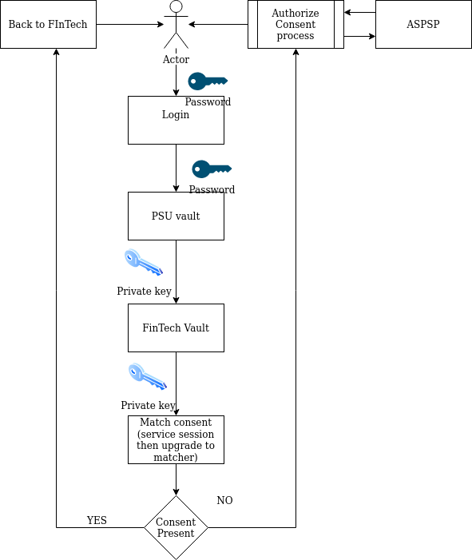

# Purpose

This module provides:
1. Protocol selection based on bank information
1. Mapping of parameters from generic map to desired context

# Technical description

Application request-response flow uses message like pattern - on each layer the resulting outcome is 
translated to the message(dto) that is native for current layer. This diagram shows the entire
flow (idealized) from the protocol internals to endpoint output:

# Consent-sharing

Consent is shared (and authorized to ASPSP) by PSU to FinTech this way:

