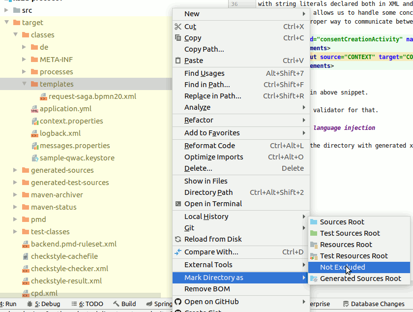

# What is this

This is the default implementation of XS2A protocol.

# How to start local environment

## 1. Run/Create postgres docker container for banking protocol

```shell script
docker run --rm  --name pg-docker -e POSTGRES_PASSWORD=docker -e POSTGRES_DB=open_banking -d -p 5432:5432 -v $HOME/docker/volumes/postgres:/var/lib/postgresql/data   postgres --max_prepared_transactions=100
```
Run [init.sql](core/banking-protocol/src/test/resources/init.sql) on it using user `postgres` and password `docker`
to create schema banking_protocol and text-extensions.

!TODO: This file is on develop branch.

## 2. Start Sandbox (all defaults)

Execute `BasicTest.testEnvStartsUp()` as java test or from maven - it will create everything it needs including UI

## 3. Start banking-protocol 

Run BankingProtocol spring application.
And you are good to go. Use localhost:8080 to access banking-protocol.


# How to design BPMN flow with Flowable

## Using Flowable docker all image:

1. This will start Flowable applications on port `8080`:
`docker run -p 8080:8080 flowable/all-in-one`
1. Open Flowable modeler:
`http://localhost:8080/flowable-modeler` (credentials are `admin/test`) 

## Coding guideline

1. Each task MUST have concrete context class referenced by variable name `CONTEXT`. This variable is used as 
input and output of task, sub-task, activity. This is done to enforce type safety and to avoid issues of dealing 
with string literals declared both in XML and Java code. 
Additionally it allows us to handle some concurrency issues and to trace data flow in code.
I.e. the only proper way to communicate between processes is:
```xml
<callActivity id="consentCreationActivity" name="consentCreationActivity" calledElement="createConsent" flowable:calledElementType="key" flowable:inheritVariables="true" flowable:fallbackToDefaultTenant="false">
  <extensionElements>
    <flowable:out source="CONTEXT" target="CONTEXT"></flowable:out>
  </extensionElements>
</callActivity>
```
Note `CONTEXT` in above snippet. 

!TODO: Add XSLT validator for that.

## Protocol customization

To customize beans that are getting called in XS2A-protocol (for example to implement bank protocol tha calls some 
custom beans, but follows XS2A flow) one can check [xs2a-sandbox-protocol](../xs2a-sandbox-protocol) directory.
Customization is done by replacing bean names in generated xml files.

## IntelliJ and language injection

### Navigation between code and BPMN diagram

To work with BPMN diagrams efficiently within IntelliJ, you need to configure language injections.
`Settings > Editor > Language Injections` -> Click import and select [language-injections.xml](docs/language-injections.xml)
This will add Ctrl-click navigation between your classes and BPMN diagrams as well as IntelliJ will allow smart refactoring.

### Working with generated XML diagrams:

1. Ensure that the directory with generated xml is not excluded. If is -> `Right click on directory` -> `Mark Directory As` -> `Not Excluded`.
